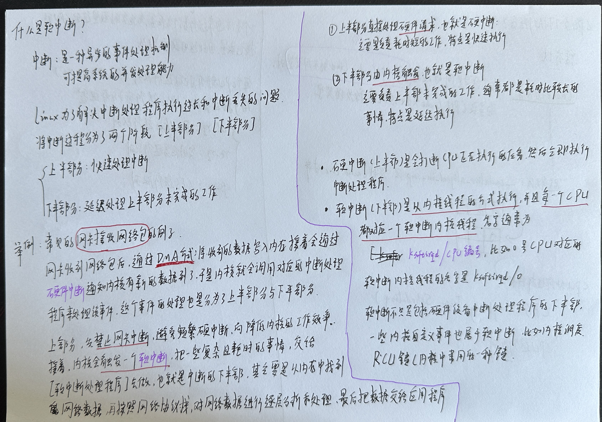
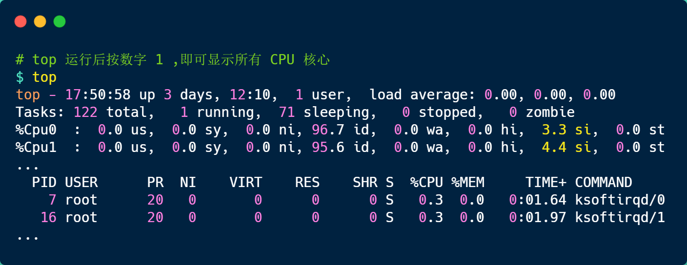
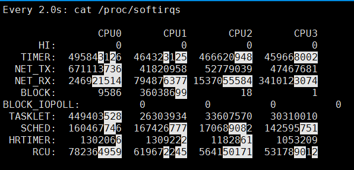
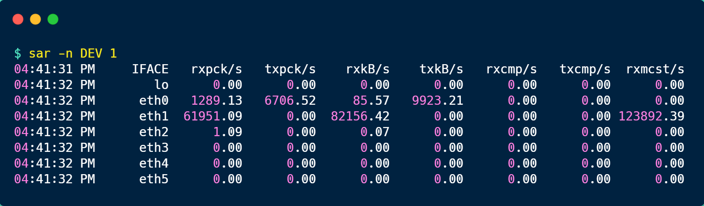

# 什么是软中断

## 1. 手绘

 

## 2. 查看系统中的中断

### 2.1 查看软中断运行情况

```bash
ubuntu@niu0217:~$ cat /proc/softirqs
                    CPU0       CPU1
          HI:          1          0
       TIMER:  850009221  771864460
      NET_TX:         19         18
      NET_RX:   88697331   89782813
       BLOCK:    8578622  147254462
    IRQ_POLL:          0          0
     TASKLET:     106876     107248
       SCHED:  673040175  621645102
     HRTIMER:      59060      53927
         RCU:  406496650  412255892
```

每一个 CPU 都有自己对应的不同类型软中断的**累计运行次数**，有 3 点需要注意下。

+ 第一点，要注意第一列的内容，它是代表着软中断的类型，在我的系统里，软中断包括了 10 个类型，分别对应不同的工作类型，比如 `NET_RX` 表示网络接收中断，`NET_TX` 表示网络发送中断、`TIMER` 表示定时中断、`RCU` 表示 RCU 锁中断、`SCHED` 表示内核调度中断。
+ 第二点，要注意同一种类型的软中断在不同 CPU 的分布情况，正常情况下，同一种中断在不同 CPU 上的累计次数相差不多，比如我的系统里，`NET_RX` 在 CPU0 、CPU1上的中断次数基本是同一个数量级，相差不多。
+ 第三点，这些数值是系统运行以来的累计中断次数，数值的大小没什么参考意义，但是系统的**中断次数的变化速率**才是我们要关注的，我们可以使用 `watch -d cat /proc/softirqs` 命令查看中断次数的变化速率。

前面提到过，软中断是以内核线程的方式执行的，我们可以用 `ps` 命令可以查看到，下面这个就是在我的服务器上查到软中断内核线程的结果：

```bash
ubuntu@niu0217:~$ ps aux | grep softirq
root          10  0.0  0.0      0     0 ?        S     2023   1:47 [ksoftirqd/0]
root          18  0.0  0.0      0     0 ?        S     2023   1:57 [ksoftirqd/1]
ubuntu   1378802  0.0  0.0  11408   724 pts/1    S+   13:14   0:00 grep --color=auto softirq
```

可以发现，内核线程的名字外面都有有中括号，这说明 ps 无法获取它们的命令行参数，所以一般来说，名字在中括号里的都可以认为是内核线程。

而且，你可以看到有 2 个 `ksoftirqd` 内核线程，这是因为我这台服务器的 CPU 是2核心的，每个 CPU 核心都对应着一个内核线程。

### 2.2 查看硬中断运行情况

```bash
ubuntu@niu0217:~$ cat /proc/interrupts
           CPU0       CPU1
  1:          0          9   IO-APIC   1-edge      i8042
  4:          8          0   IO-APIC   4-edge      ttyS0
  6:          0          3   IO-APIC   6-edge      floppy
  8:          0          0   IO-APIC   8-edge      rtc0
  9:          0          0   IO-APIC   9-fasteoi   acpi
 11:          0          0   IO-APIC  11-fasteoi   virtio2, uhci_hcd:usb1
 12:         15          0   IO-APIC  12-edge      i8042
 14:   17130141          0   IO-APIC  14-edge      ata_piix
 15:          0          0   IO-APIC  15-edge      ata_piix
 24:         40          0   PCI-MSI 81920-edge      virtio0-config
 25:   42026618          1   PCI-MSI 81921-edge      virtio0-input.0
 26:   46060247          0   PCI-MSI 81922-edge      virtio0-output.0
 27:          0   42546548   PCI-MSI 81923-edge      virtio0-input.1
 28:          2   46625625   PCI-MSI 81924-edge      virtio0-output.1
 29:          0          0   PCI-MSI 98304-edge      virtio1-config
 30:          0  147291700   PCI-MSI 98305-edge      virtio1-req.0
NMI:          0          0   Non-maskable interrupts
LOC:   50246870   10637332   Local timer interrupts
SPU:          0          0   Spurious interrupts
PMI:          0          0   Performance monitoring interrupts
IWI:         23         17   IRQ work interrupts
RTR:          0          0   APIC ICR read retries
RES: 1666640086 1682296280   Rescheduling interrupts
CAL:   25337640   24990240   Function call interrupts
TLB:  147295793  143632542   TLB shootdowns
TRM:          0          0   Thermal event interrupts
THR:          0          0   Threshold APIC interrupts
DFR:          0          0   Deferred Error APIC interrupts
MCE:          0          0   Machine check exceptions
MCP:      55468      55468   Machine check polls
HYP:          0          0   Hypervisor callback interrupts
HRE:          0          0   Hyper-V reenlightenment interrupts
HVS:          0          0   Hyper-V stimer0 interrupts
ERR:          0
MIS:          0
PIN:          0          0   Posted-interrupt notification event
NPI:          0          0   Nested posted-interrupt event
PIW:          0          0   Posted-interrupt wakeup event
```

## 3. 如何定位软中断CPU使用率过高的问题

要想知道当前的系统的软中断情况，我们可以使用 `top` 命令查看，下面是一台服务器上的 top 的数据：

 

上图中的黄色部分 `si`，就是 CPU 在软中断上的使用率，而且可以发现，每个 CPU 使用率都不高，两个 CPU 的使用率虽然只有 3% 和 4% 左右，但是都是用在软中断上了。

另外，也可以看到 CPU 使用率最高的进程也是软中断 `ksoftirqd`，因此可以认为此时系统的开销主要来源于软中断。

如果要知道是哪种软中断类型导致的，我们可以使用 `watch -d cat /proc/softirqs` 命令查看每个软中断类型的中断次数的变化速率。

 

一般对于网络 I/O 比较高的 Web 服务器，`NET_RX` 网络接收中断的变化速率相比其他中断类型快很多。

如果发现 `NET_RX` 网络接收中断次数的变化速率过快，接下来就可以使用 `sar -n DEV` 查看网卡的网络包接收速率情况，然后分析是哪个网卡有大量的网络包进来。

 

接着，在通过 `tcpdump` 抓包，分析这些包的来源，如果是非法的地址，可以考虑加防火墙，如果是正常流量，则要考虑硬件升级等。

## 3. 总结

为了避免由于中断处理程序执行时间过长，而影响正常进程的调度，Linux 将中断处理程序分为上半部和下半部：

- 上半部，对应硬中断，由硬件触发中断，用来快速处理中断；
- 下半部，对应软中断，由内核触发中断，用来异步处理上半部未完成的工作；

Linux 中的软中断包括网络收发、定时、调度、RCU 锁等各种类型，可以通过查看 /proc/softirqs 来观察软中断的累计中断次数情况，如果要实时查看中断次数的变化率，可以使用 watch -d cat /proc/softirqs 命令。

每一个 CPU 都有各自的软中断内核线程，我们还可以用 ps 命令来查看内核线程，一般名字在中括号里面到，都认为是内核线程。

如果在 top 命令发现，CPU 在软中断上的使用率比较高，而且 CPU 使用率最高的进程也是软中断 ksoftirqd 的时候，这种一般可以认为系统的开销被软中断占据了。

这时我们就可以分析是哪种软中断类型导致的，一般来说都是因为网络接收软中断导致的，如果是的话，可以用 sar 命令查看是哪个网卡的有大量的网络包接收，再用 tcpdump 抓网络包，做进一步分析该网络包的源头是不是非法地址，如果是就需要考虑防火墙增加规则，如果不是，则考虑硬件升级等。

