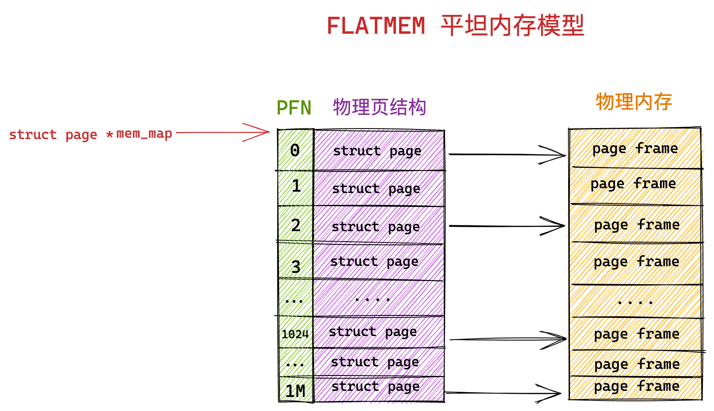
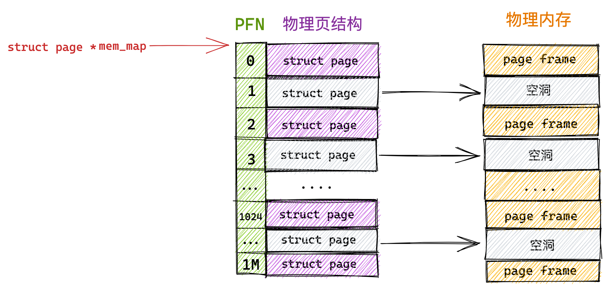
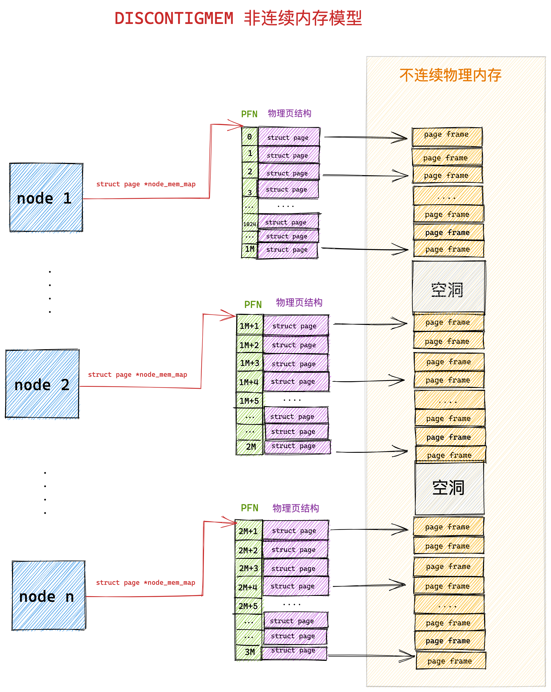
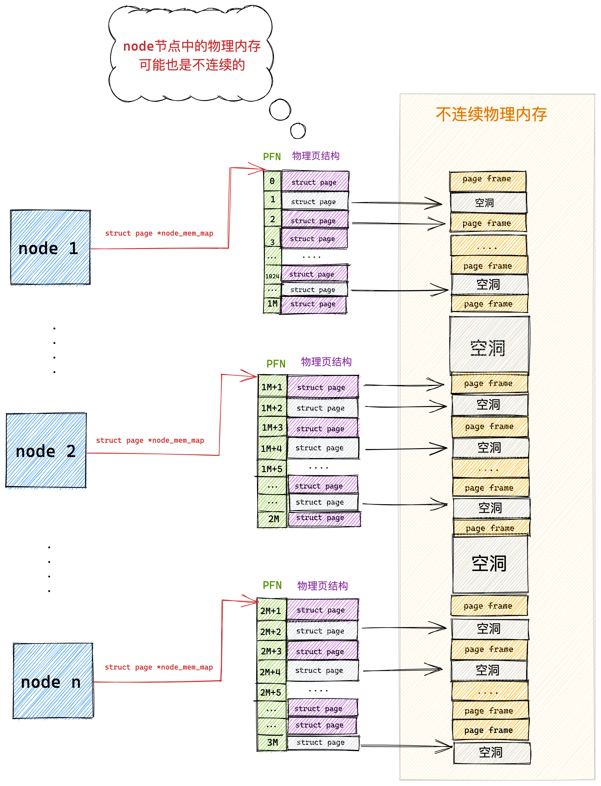
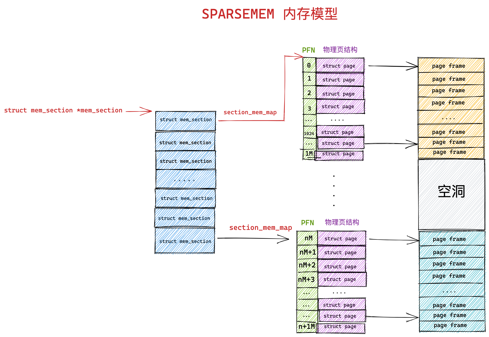
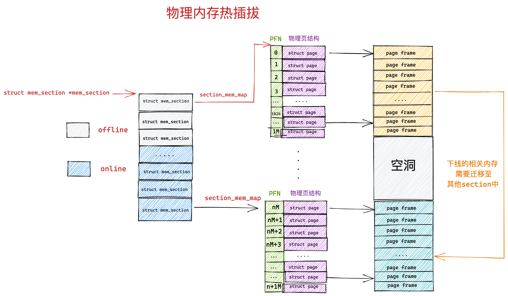
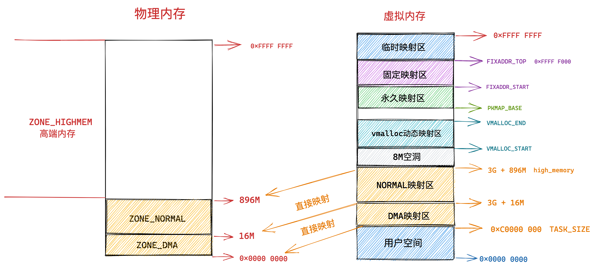

# 从 CPU 角度看物理内存模型

内核是以页为基本单位对物理内存进行管理的，通过将物理内存划分为一页一页的内存块，每页大小为 4K。一页大小的内存块在内核中用 struct page 结构体来进行管理，struct page 中封装了每页内存块的状态信息，比如：组织结构，使用信息，统计信息，以及与其他结构的关联映射信息等。

而为了快速索引到具体的物理内存页，内核为每个物理页 struct page 结构体定义了一个索引编号：PFN（Page Frame Number）。PFN 与 struct page 是一一对应的关系。

内核提供了两个宏来完成 PFN 与 物理页结构体 struct page 之间的相互转换。它们分别是 

+ page_to_pfn ；
+ pfn_to_page；

内核中如何组织管理这些物理内存页 struct page 的方式我们称之为做物理内存模型，不同的物理内存模型，应对的场景以及 page_to_pfn 与 pfn_to_page 的计算逻辑都是不一样的

## 1. FLATMEM 平坦内存模型

我们先把物理内存想象成一片地址连续的存储空间，在这一大片地址连续的内存空间中，内核将这块内存空间分为一页一页的内存块 struct page 。

由于这块物理内存是连续的，物理地址也是连续的，划分出来的这一页一页的物理页必然也是连续的，并且每页的大小都是固定的，所以我们很容易想到用一个数组来组织这些连续的物理内存页 struct page 结构，其在数组中对应的下标即为 PFN 。这种内存模型就叫做平坦内存模型 FLATMEM 。

 

内核中使用了一个 mem_map 的全局数组用来组织所有划分出来的物理内存页。mem_map 全局数组的下标就是相应物理页对应的 PFN.

在平坦内存模型下 ，page_to_pfn 与 pfn_to_page 的计算逻辑就非常简单，本质就是基于 mem_map 数组进行偏移操作。

```c
#if defined(CONFIG_FLATMEM)
#define __pfn_to_page(pfn) (mem_map + ((pfn)-ARCH_PFN_OFFSET))
#define __page_to_pfn(page) ((unsigned long)((page)-mem_map) + ARCH_PFN_OFFSET)
#endif
```

> ARCH_PFN_OFFSET 是 PFN 的起始偏移量。

Linux 早期使用的就是这种内存模型，因为在 Linux 发展的早期所需要管理的物理内存通常不大（比如几十 MB），那时的 Linux 使用平坦内存模型 FLATMEM 来管理物理内存就足够高效了。

> 内核中的默认配置是使用 FLATMEM 平坦内存模型。

## 2. DISCONTIGMEM 非连续内存模型

FLATMEM 平坦内存模型只适合管理一整块连续的物理内存，而对于多块非连续的物理内存来说使用 FLATMEM 平坦内存模型进行管理则会造成很大的内存空间浪费。

因为 FLATMEM 平坦内存模型是利用 mem_map 这样一个全局数组来组织这些被划分出来的物理页 page 的，而对于物理内存存在大量不连续的内存地址区间这种情况时，这些不连续的内存地址区间就形成了内存空洞。

由于用于组织物理页的底层数据结构是 mem_map 数组，数组的特性又要求这些物理页是连续的，所以只能为这些内存地址空洞也分配 struct page 结构用来填充数组使其连续。

而每个 struct page 结构大部分情况下需要占用 40 字节（struct page 结构在不同场景下内存占用会有所不同，这一点我们后面再说），如果物理内存中存在的大块的地址空洞，那么为这些空洞而分配的 struct page 将会占用大量的内存空间，导致巨大的浪费。

 

为了组织和管理这些不连续的物理内存，内核于是引入了 DISCONTIGMEM 非连续内存模型，用来消除这些不连续的内存地址空洞对 mem_map 的空间浪费。

在 DISCONTIGMEM 非连续内存模型中，内核将物理内存从宏观上划分成了一个一个的节点 node （微观上还是一页一页的物理页），每个 node 节点管理一块连续的物理内存。这样一来这些连续的物理内存页均被划归到了对应的 node 节点中管理，就避免了内存空洞造成的空间浪费。

 

内核中使用 struct pglist_data 表示用于管理连续物理内存的 node 节点（内核假设 node 中的物理内存是连续的），既然每个 node 节点中的物理内存是连续的，于是在每个 node 节点中还是采用 FLATMEM 平坦内存模型的方式来组织管理物理内存页。每个 node 节点中包含一个 `struct page *node_mem_map` 数组，用来组织管理 node 中的连续物理内存页。

```c
typedef struct pglist_data {
   #ifdef CONFIG_FLATMEM
	  struct page *node_mem_map;
   #endif
}
```

我们可以看出 DISCONTIGMEM 非连续内存模型其实就是 FLATMEM 平坦内存模型的一种扩展，在面对大块不连续的物理内存管理时，通过将每段连续的物理内存区间划归到 node 节点中进行管理，避免了为内存地址空洞分配 struct page 结构，从而节省了内存资源的开销。

由于引入了 node 节点这个概念，所以在 DISCONTIGMEM 非连续内存模型下 page_to_pfn 与 pfn_to_page 的计算逻辑就比 FLATMEM 内存模型下的计算逻辑多了一步定位 page 所在 node 的操作。

- 通过 arch_pfn_to_nid 可以根据物理页的 PFN 定位到物理页所在 node。
- 通过 page_to_nid 可以根据物理页结构 struct page 定义到 page 所在 node。

当定位到物理页 struct page 所在 node 之后，剩下的逻辑就和 FLATMEM 内存模型一模一样了。

```c
#if defined(CONFIG_DISCONTIGMEM)

#define __pfn_to_page(pfn)			\
({	unsigned long __pfn = (pfn);		\
	unsigned long __nid = arch_pfn_to_nid(__pfn);  \
	NODE_DATA(__nid)->node_mem_map + arch_local_page_offset(__pfn, __nid);\
})

#define __page_to_pfn(pg)						\
({	const struct page *__pg = (pg);					\
	struct pglist_data *__pgdat = NODE_DATA(page_to_nid(__pg));	\
	(unsigned long)(__pg - __pgdat->node_mem_map) +			\
	 __pgdat->node_start_pfn;					\
})
```

## 3. SPARSEMEM 稀疏内存模型

随着内存技术的发展，内核可以支持物理内存的热插拔了（后面我会介绍），这样一来物理内存的不连续就变为常态了，在上小节介绍的 DISCONTIGMEM 内存模型中，其实每个 node 中的物理内存也不一定都是连续的。

 

而且每个 node 中都有一套完整的内存管理系统，如果 node 数目多的话，那这个开销就大了，于是就有了对连续物理内存更细粒度的管理需求，为了能够更灵活地管理粒度更小的连续物理内存，SPARSEMEM 稀疏内存模型就此登场了。

SPARSEMEM 稀疏内存模型的核心思想就是对粒度更小的连续内存块进行精细的管理，用于管理连续内存块的单元被称作 section 。物理页大小为 4k 的情况下， section 的大小为 128M ，物理页大小为 16k 的情况下， section 的大小为 512M。

在内核中用 struct mem_section 结构体表示 SPARSEMEM 模型中的 section。

```c
struct mem_section {
	unsigned long section_mem_map;
        ...
}
```

由于 section 被用作管理小粒度的连续内存块，这些小的连续物理内存在 section 中也是通过数组的方式被组织管理，每个 struct mem_section 结构体中有一个 section_mem_map 指针用于指向 section 中管理连续内存的 page 数组。

SPARSEMEM 内存模型中的这些所有的 mem_section 会被存放在一个全局的数组中，并且每个 mem_section 都可以在系统运行时改变 offline / online （下线 / 上线）状态，以便支持内存的热插拔（hotplug）功能。

```c
#ifdef CONFIG_SPARSEMEM_EXTREME
extern struct mem_section *mem_section[NR_SECTION_ROOTS];
```

 

在 SPARSEMEM 稀疏内存模型下 page_to_pfn 与 pfn_to_page 的计算逻辑又发生了变化。

- 在 page_to_pfn 的转换中，首先需要通过 page_to_section 根据 struct page 结构定位到 mem_section 数组中具体的 section 结构。然后再通过 section_mem_map 定位到具体的 PFN。

> 在 struct page 结构中有一个 `unsigned long flags` 属性，在 flag 的高位 bit 中存储着 page 所在 mem_section 数组中的索引，从而可以定位到所属 section。

+ 在 pfn_to_page 的转换中，首先需要通过 __pfn_to_section 根据 PFN 定位到 mem_section 数组中具体的 section 结构。然后在通过 PFN 在 section_mem_map 数组中定位到具体的物理页 Page 。

> PFN 的高位 bit 存储的是全局数组 mem_section 中的 section 索引，PFN 的低位 bit 存储的是 section_mem_map 数组中具体物理页 page 的索引。

```c
#if defined(CONFIG_SPARSEMEM)
/*
 * Note: section's mem_map is encoded to reflect its start_pfn.
 * section[i].section_mem_map == mem_map's address - start_pfn;
 */
#define __page_to_pfn(pg)					\
({	const struct page *__pg = (pg);				\
	int __sec = page_to_section(__pg);			\
	(unsigned long)(__pg - __section_mem_map_addr(__nr_to_section(__sec)));	\
})

#define __pfn_to_page(pfn)				\
({	unsigned long __pfn = (pfn);			\
	struct mem_section *__sec = __pfn_to_section(__pfn);	\
	__section_mem_map_addr(__sec) + __pfn;		\
})
#endif
```

从以上的内容介绍中，我们可以看出 SPARSEMEM 稀疏内存模型已经完全覆盖了前两个内存模型的所有功能，因此稀疏内存模型可被用于所有内存布局的情况

## 4. 物理内存热插拔

前面提到随着内存技术的发展，物理内存的热插拔 hotplug 在内核中得到了支持，由于物理内存可以动态的从主板中插入以及拔出，所以导致了物理内存的不连续已经成为常态，因此内核引入了 SPARSEMEM 稀疏内存模型以便应对这种情况，提供对更小粒度的连续物理内存的灵活管理能力。

本小节我就为大家介绍一下物理内存热插拔 hotplug 功能在内核中的实现原理，作为 SPARSEMEM 稀疏内存模型的扩展内容补充。

在大规模的集群中，尤其是现在我们处于云原生的时代，为了实现集群资源的动态均衡，可以通过物理内存热插拔的功能实现集群机器物理内存容量的动态增减。

集群的规模一大，那么物理内存出故障的几率也会大大增加，物理内存的热插拔对提供集群高可用性也是至关重要的。

从总体上来讲，内存的热插拔分为两个阶段：

- 物理热插拔阶段：这个阶段主要是从物理上将内存硬件插入（hot-add），拔出（hot-remove）主板的过程，其中涉及到硬件和内核的支持。
- 逻辑热插拔阶段：这一阶段主要是由内核中的内存管理子系统来负责，涉及到的主要工作为：如何动态的上线启用（online）刚刚 hot-add 的内存，如何动态下线（offline）刚刚 hot-remove 的内存。

物理内存拔出的过程需要关注的事情比插入的过程要多的多，实现起来也更加的困难, 这就好比在[《Java 技术栈中间件优雅停机方案设计与实现全景图》 (opens new window)](https://mp.weixin.qq.com/s?__biz=Mzg2MzU3Mjc3Ng==&mid=2247485290&idx=1&sn=58d7eb2c25c2e51b41e35a4ce4dab517&chksm=ce77c12df900483bf5a0edc6b31e710d6e3019deeeb788ed89faa69f9055872e85d518ee52f6&token=65686925&lang=zh_CN#rd)一文中我们讨论服务优雅启动，停机时提到的：优雅停机永远比优雅启动要考虑的场景要复杂的多，因为停机的时候，线上的服务正在承载着生产的流量需要确保做到业务无损。

同样的道理，物理内存插入比较好说，困难的是物理内存的动态拔出，因为此时即将要被拔出的物理内存中可能已经为进程分配了物理页，如何妥善安置这些已经被分配的物理页是一个棘手的问题。

前边我们介绍 SPARSEMEM 内存模型的时候提到，每个 mem_section 都可以在系统运行时改变 offline ，online 状态，以便支持内存的热插拔（hotplug）功能。 当 mem_section offline 时, 内核会把这部分内存隔离开, 使得该部分内存不可再被使用, 然后再把 mem_section 中已经分配的内存页迁移到其他 mem_section 的内存上. 。

 

但是这里会有一个问题，就是并非所有的物理页都可以迁移，因为迁移意味着物理内存地址的变化，而内存的热插拔应该对进程来说是透明的，所以这些迁移后的物理页映射的虚拟内存地址是不能变化的。

这一点在进程的用户空间是没有问题的，因为进程在用户空间访问内存都是根据虚拟内存地址通过页表找到对应的物理内存地址，这些迁移之后的物理页，虽然物理内存地址发生变化，但是内核通过修改相应页表中虚拟内存地址与物理内存地址之间的映射关系，可以保证虚拟内存地址不会改变。

 

但是在内核态的虚拟地址空间中，有一段直接映射区，在这段虚拟内存区域中虚拟地址与物理地址是直接映射的关系，虚拟内存地址直接减去一个固定的偏移量（0xC000 0000 ） 就得到了物理内存地址。

直接映射区中的物理页的虚拟地址会随着物理内存地址变动而变动, 因此这部分物理页是无法轻易迁移的，然而不可迁移的页会导致内存无法被拔除，因为无法妥善安置被拔出内存中已经为进程分配的物理页。那么内核是如何解决这个头疼的问题呢？

既然是这些不可迁移的物理页导致内存无法拔出，那么我们可以把内存分一下类，将内存按照物理页是否可迁移，划分为不可迁移页，可回收页，可迁移页。

> 大家这里需要记住一点，内核会将物理内存按照页面是否可迁移的特性进行分类，我后面在介绍内核如何避免内存碎片的时候还会在提到

然后在这些可能会被拔出的内存中只分配那些可迁移的内存页，这些信息会在内存初始化的时候被设置，这样一来那些不可迁移的页就不会包含在可能会拔出的内存中，当我们需要将这块内存热拔出时, 因为里边的内存页全部是可迁移的, 从而使内存可以被拔除。


