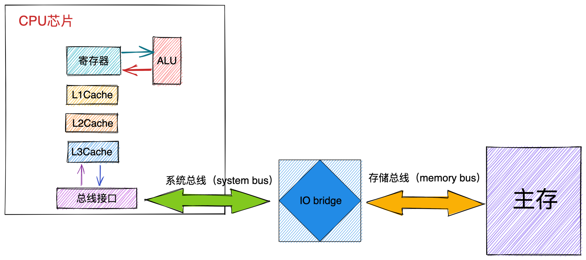
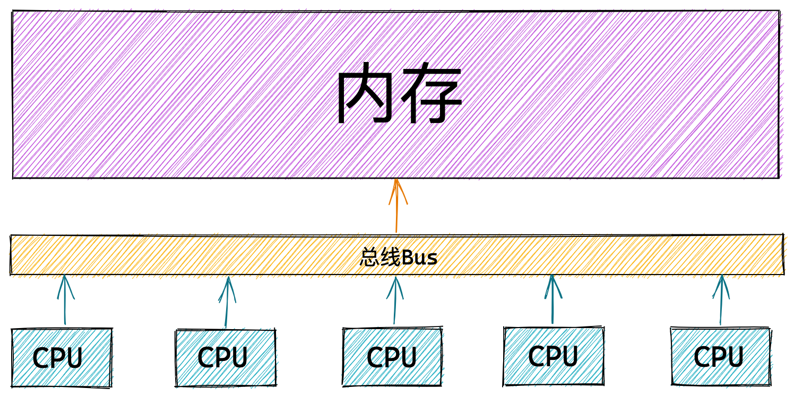
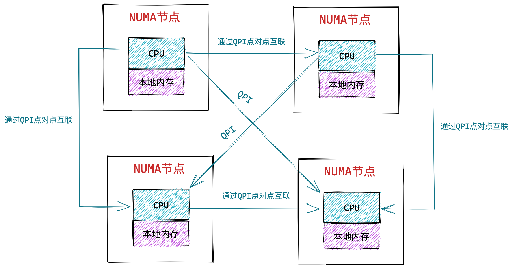

# 从CPU角度看物理内存架构

## 1. 一致性内存访问 UMA 架构

 

- 首先 CPU 将物理内存地址作为地址信号放到系统总线上传输。随后 IO bridge 将系统总线上的地址信号转换为存储总线上的电子信号。
- 主存感受到存储总线上的地址信号并通过存储控制器将存储总线上的物理内存地址 A 读取出来。
- 存储控制器通过物理内存地址定位到具体的存储器模块，从 DRAM 芯片中取出物理内存地址对应的数据。
- 存储控制器将读取到的数据放到存储总线上，随后 IO bridge 将存储总线上的数据信号转换为系统总线上的数据信号，然后继续沿着系统总线传递。
- CPU 芯片感受到系统总线上的数据信号，将数据从系统总线上读取出来并拷贝到寄存器中。

上图展示的是单核 CPU 访问内存的架构图，那么在多核服务器中多个 CPU 与内存之间的架构关系又是什么样子的呢？

 

在 UMA 架构下，多核服务器中的多个 CPU 位于总线的一侧，所有的内存条组成一大片内存位于总线的另一侧，所有的 CPU 访问内存都要过总线，而且距离都是一样的，由于所有 CPU 对内存的访问距离都是一样的，所以在 UMA 架构下所有 CPU 访问内存的速度都是一样的。这种访问模式称为 SMP（Symmetric multiprocessing），即对称多处理器。

> 这里的一致性是指同一个 CPU 对所有内存的访问的速度是一样的。即一致性内存访问 UMA（Uniform Memory Access）。

但是随着多核技术的发展，服务器上的 CPU 个数会越来越多，而 UMA 架构下所有 CPU 都是需要通过总线来访问内存的，这样总线很快就会成为性能瓶颈，主要体现在以下两个方面：

1. 总线的带宽压力会越来越大，随着 CPU 个数的增多导致每个 CPU 可用带宽会减少；
2. 总线的长度也会因此而增加，进而增加访问延迟；

UMA 架构的优点很明显就是结构简单，所有的 CPU 访问内存速度都是一致的，都必须经过总线。然而它的缺点我刚刚也提到了，就是随着处理器核数的增多，总线的带宽压力会越来越大。解决办法就只能扩宽总线，然而成本十分高昂，未来可能仍然面临带宽压力。

为了解决以上问题，提高 CPU 访问内存的性能和扩展性，于是引入了一种新的架构：非一致性内存访问 NUMA（Non-uniform memory access）。

## 2. 非一致性内存访问 NUMA 架构

在 NUMA 架构下，内存就不是一整片的了，而是被划分成了一个一个的内存节点 （NUMA 节点），每个 CPU 都有属于自己的本地内存节点，CPU 访问自己的本地内存不需要经过总线，因此访问速度是最快的。当 CPU 自己的本地内存不足时，CPU 就需要跨节点去访问其他内存节点，这种情况下 CPU 访问内存就会慢很多。

在 NUMA 架构下，任意一个 CPU 都可以访问全部的内存节点，访问自己的本地内存节点是最快的，但访问其他内存节点就会慢很多，这就导致了 CPU 访问内存的速度不一致，所以叫做非一致性内存访问架构。

 

如上图所示，CPU 和它的本地内存组成了 NUMA 节点，CPU 与 CPU 之间通过 QPI（Intel QuickPath Interconnect）点对点完成互联，在 CPU 的本地内存不足的情况下，CPU 需要通过 QPI 访问远程 NUMA 节点上的内存控制器从而在远程内存节点上分配内存，这就导致了远程访问比本地访问多了额外的延迟开销（需要通过 QPI 遍历远程 NUMA 节点）。

> 在 NUMA 架构下，只有 DISCONTIGMEM 非连续内存模型和 SPARSEMEM 稀疏内存模型是可用的。而 UMA 架构下，前面介绍的三种内存模型都可以配置使用

### 2.1 NUMA 的内存分配策略

NUMA 的内存分配策略是指在 NUMA 架构下 CPU 如何请求内存分配的相关策略，比如：是优先请求本地内存节点分配内存呢 ？还是优先请求指定的 NUMA 节点分配内存 ？是只能在本地内存节点分配呢 ？还是允许当本地内存不足的情况下可以请求远程 NUMA 节点分配内存 ？

|   内存分配策略    |                           策略描述                           |
| :---------------: | :----------------------------------------------------------: |
|     MPOL_BIND     |   必须在绑定的节点进行内存分配，如果内存不足，则进行 swap    |
|  MPOL_INTERLEAVE  |              本地节点和远程节点均可允许分配内存              |
|  MPOL_PREFERRED   | 优先在指定节点分配内存，当指定节点内存不足时，选择离指定节点最近的节点分配内存 |
| MPOL_LOCAL (默认) | 优先在本地节点分配，当本地节点内存不足时，可以在远程节点分配内存 |

我们可以在应用程序中通过 libnuma 共享库中的 API 调用 set_mempolicy 接口设置进程的内存分配策略。

```c
#include <numaif.h>

long set_mempolicy(int mode, const unsigned long *nodemask,
                          unsigned long maxnode);
```

- mode : 指定 NUMA 内存分配策略。
- nodemask：指定 NUMA 节点 Id。
- maxnode：指定最大 NUMA 节点 Id，用于遍历远程节点，实现跨 NUMA 节点分配内存。

> libnuma 共享库 API 文档：https://man7.org/linux/man-pages/man3/numa.3.html#top_of_page

> set_mempolicy 接口文档：https://man7.org/linux/man-pages/man2/set_mempolicy.2.html

### 2.2 NUMA 的使用简介

#### 2.2.1 查看 NUMA 相关信息

CPU 在访问本地 NUMA 节点中的内存时，速度是最快的。但是当访问远程 NUMA 节点，速度就会相对很慢，那么到底有多慢？本地节点与远程节点之间的访问速度差异具体是多少 ？

> numactl 文档：https://man7.org/linux/man-pages/man8/numactl.8.html

针对以上具体问题，`numactl -H` 命令可以给出我们想要的答案

```bash
available: 4 nodes (0-3)
node 0 cpus: 0 1 2 3 4 5 6 7 8 9 10 11 12 13 14 15 
node 0 size: 64794 MB
node 0 free: 55404 MB

node 1 cpus: 16 17 18 19 20 21 22 23 24 25 26 27 28 29 30 31
node 1 size: 65404 MB
node 1 free: 58642 MB

node 2 cpus: 32 33 34 35 36 37 38 39 40 41 42 43 44 45 46 47
node 2 size: 65404 MB
node 2 free: 61181 MB

node 3 cpus:  48 49 50 51 52 53 54 55 56 57 58 59 60 61 62 63
node 3 size: 65402 MB
node 3 free: 55592 MB

node distances:
node   0   1   2   3
  0:  10  16  32  33
  1:  16  10  25  32
  2:  32  25  10  16
  3:  33  32  16  10
```

`numactl -H` 命令可以查看服务器的 NUMA 配置，上图中的服务器配置共包含 4 个 NUMA 节点（0 - 3），每个 NUMA 节点中包含 16个 CPU 核心，本地内存大小约为 64G。

大家可以关注下最后 `node distances:` 这一栏，node distances 给出了不同 NUMA 节点之间的访问距离，对角线上的值均为本地节点的访问距离 10 。比如 [0,0] 表示 NUMA 节点 0 的本地内存访问距离。

我们可以很明显的看到当出现跨 NUMA 节点访问的时候，访问距离就会明显增加，比如节点 0 访问节点 1 的距离 [0,1] 是16，节点 0 访问节点 3 的距离 [0,3] 是 33。距离越远，跨 NUMA 节点内存访问的延时越大。应用程序运行时应减少跨 NUMA 节点访问内存。

此外我们还可以通过 `numactl -s` 来查看 NUMA 的内存分配策略设置：

```bash
policy: default
preferred node: current
```

通过 `numastat` 还可以查看各个 NUMA 节点的内存访问命中率：

```bash
                           node0           node1            node2           node3
numa_hit              1296554257       918018444         1296574252       828018454
numa_miss                8541758        40297198           7544751        41267108
numa_foreign            40288595         8550361          41488585         8450375
interleave_hit             45651           45918            46654           49718
local_node            1231897031       835344122         1141898045       915354158
other_node              64657226        82674322           594657725       82675425
```

- numa_hit ：内存分配在该节点中成功的次数。
- numa_miss : 内存分配在该节点中失败的次数。
- numa_foreign：表示其他 NUMA 节点本地内存分配失败，跨节点（numa_miss）来到本节点分配内存的次数。
- interleave_hit : 在 MPOL_INTERLEAVE 策略下，在本地节点分配内存的次数。
- local_node：进程在本地节点分配内存成功的次数。
- other_node：运行在本节点的进程跨节点在其他节点上分配内存的次数。

> numastat 文档：https://man7.org/linux/man-pages/man8/numastat.8.html

#### 2.2.2 绑定 NUMA 节点

numactl 工具可以让我们应用程序指定运行在哪些 CPU 核心上，同时也可以指定我们的应用程序可以在哪些 NUMA 节点上分配内存。通过将应用程序与具体的 CPU 核心和 NUMA 节点绑定，从而可以提升程序的性能。

```bash
numactl --membind=nodes  --cpunodebind=nodes  command
```

- 通过 `--membind` 可以指定我们的应用程序只能在哪些具体的 NUMA 节点上分配内存，如果这些节点内存不足，则分配失败。
- 通过 `--cpunodebind` 可以指定我们的应用程序只能运行在哪些 NUMA 节点上。

```bash
numactl --physcpubind=cpus  command
```

另外我们还可以通过 `--physcpubind` 将我们的应用程序绑定到具体的物理 CPU 上。这个选项后边指定的参数我们可以通过 `cat /proc/cpuinfo` 输出信息中的 processor 这一栏查看。例如：通过 `numactl --physcpubind= 0-15 ./numatest.out` 命令将进程 numatest 绑定到 0~15 CPU 上执行。

我们可以通过 numactl 命令将 numatest 进程分别绑定在相同的 NUMA 节点上和不同的 NUMA 节点上，运行观察。

```bash
numactl --membind=0 --cpunodebind=0 ./numatest.out
numactl --membind=0 --cpunodebind=1 ./numatest.out
```

大家肯定一眼就能看出绑定在相同 NUMA 节点的进程运行会更快，因为通过前边对 NUMA 架构的介绍，我们知道 CPU 访问本地 NUMA 节点的内存是最快的。

> 除了 numactl 这个工具外，我们还可以通过共享库 libnuma 在程序中进行 NUMA 相关的操作。这里我就不演示了，感兴趣可以查看下 libnuma 的 API 文档：https://man7.org/linux/man-pages/man3/numa.3.html#top_of_page

