# 内核虚拟内存空间

## 引入

不同进程之间的虚拟内存空间是相互隔离的，彼此之间相互独立，相互感知不到其他进程的存在。使得进程以为自己拥有所有的内存资源。

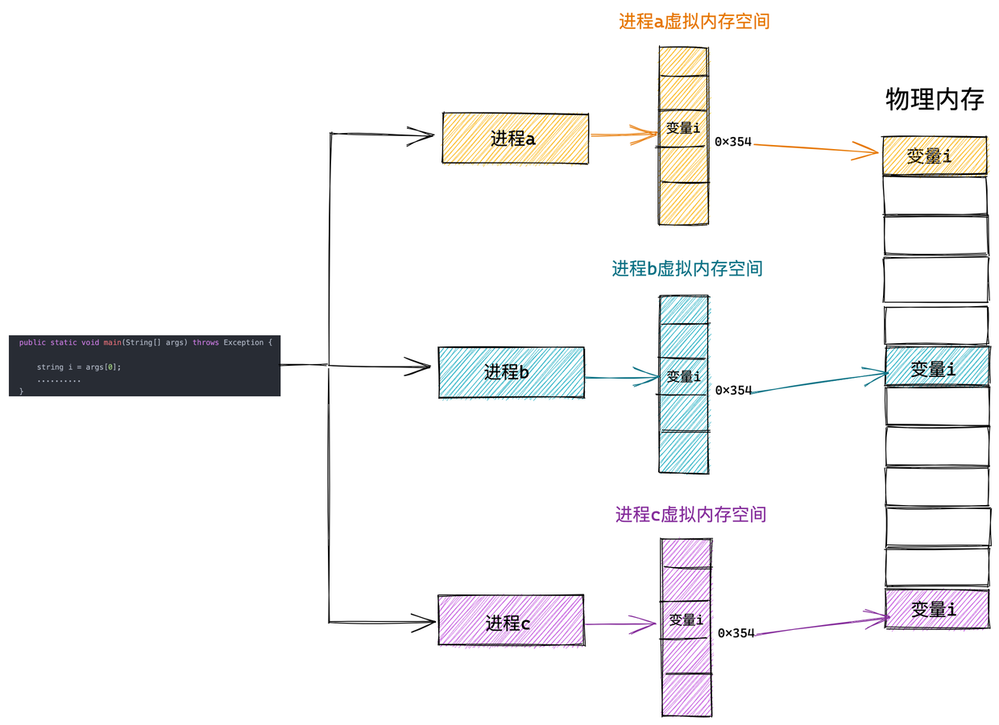 


而内核态虚拟内存空间是所有进程共享的，不同进程进入内核态之后看到的虚拟内存空间全部是一样的。

什么意思呢？比如上图中的进程 a，进程 b，进程 c 分别在各自的用户态虚拟内存空间中访问虚拟地址 x 。由于进程之间的用户态虚拟内存空间是相互隔离相互独立的，虽然在进程a，进程b，进程c 访问的都是虚拟地址 x 但是看到的内容却是不一样的（背后可能映射到不同的物理内存中）。

但是当进程 a，进程 b，进程 c 进入到内核态之后情况就不一样了，由于内核虚拟内存空间是各个进程共享的，所以它们在内核空间中看到的内容全部是一样的，比如进程 a，进程 b，进程 c 在内核态都去访问虚拟地址 y。这时它们看到的内容就是一样的了。

> 这里我和大家澄清一个经常被误解的概念：由于内核会涉及到物理内存的管理，所以很多人会想当然地认为只要进入了内核态就开始使用物理地址了，这就大错特错了，千万不要这样理解，进程进入内核态之后使用的仍然是虚拟内存地址，只不过在内核中使用的虚拟内存地址被限制在了内核态虚拟内存空间范围中，这也是本小节我要为大家介绍的主题。

在清楚了这个基本概念之后，下面我分别从 32 位体系 和 64 位体系下为大家介绍内核态虚拟内存空间的布局。

## 1. 32 位体系内核虚拟内存空间布局

内核在 `/arch/x86/include/asm/page_32_types.h` 文件中通过 TASK_SIZE 将进程虚拟内存空间和内核虚拟内存空间分割开来。

```c
/*
 * User space process size: 3GB (default).
 */
#define TASK_SIZE       __PAGE_OFFSET
```

> __PAGE_OFFSET 的值在 32 位系统下为 0xC000 000

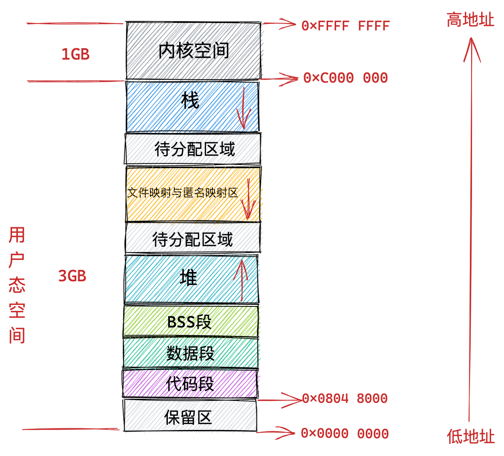 

在 32 位体系结构下进程用户态虚拟内存空间为 3 GB，虚拟内存地址范围为：0x0000 0000 - 0xC000 000 。内核态虚拟内存空间为 1 GB，虚拟内存地址范围为：0xC000 000 - 0xFFFF FFFF。

本小节我们主要关注 0xC000 000 - 0xFFFF FFFF 这段虚拟内存地址区域也就是内核虚拟内存空间的布局情况。

### 1.1 直接映射区

在总共大小 1G 的内核虚拟内存空间中，位于最前边有一块 896M 大小的区域，我们称之为直接映射区或者线性映射区，地址范围为 3G -- 3G + 896m 。

之所以这块 896M 大小的区域称为直接映射区或者线性映射区，是因为这块连续的虚拟内存地址会映射到 0 - 896M 这块连续的物理内存上。

也就是说 3G -- 3G + 896m 这块 896M 大小的虚拟内存会直接映射到 0 - 896M 这块 896M 大小的物理内存上，**这块区域中的虚拟内存地址直接减去 0xC000 0000 (3G) 就得到了物理内存地址**。所以我们称这块区域为直接映射区。

> 为了方便为大家解释，我们假设现在机器上的物理内存为 4G 大小

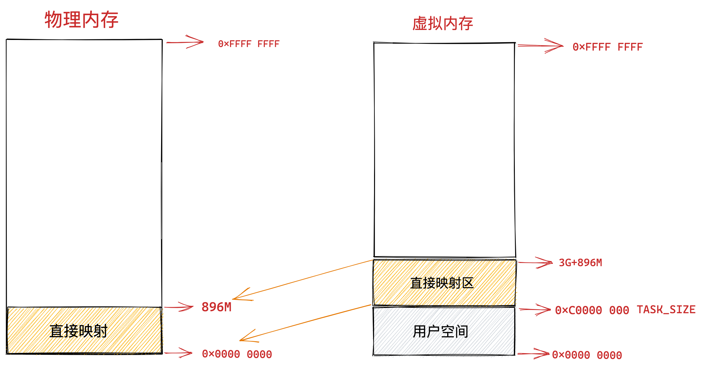 

> 虽然这块区域中的虚拟地址是直接映射到物理地址上，但是内核在访问这段区域的时候还是走的虚拟内存地址，内核也会为这块空间建立映射页表。关于页表的概念我后续会为大家详细讲解，这里大家只需要简单理解为页表保存了虚拟地址到物理地址的映射关系即可。

**大家这里只需要记得内核态虚拟内存空间的前 896M 区域是直接映射到物理内存中的前 896M 区域中的，直接映射区中的映射关系是一比一映射。映射关系是固定的不会改变**。

明白了这个关系之后，我们接下来就看一下这块直接映射区域在物理内存中究竟存的是什么内容~~~

在这段 896M 大小的物理内存中，前 1M 已经在系统启动的时候被系统占用，1M 之后的物理内存存放的是内核代码段，数据段，BSS 段（这些信息起初存放在 ELF格式的二进制文件中，在系统启动的时候被加载进内存）。

> 我们可以通过 `cat /proc/iomem` 命令查看具体物理内存布局情况。

当我们使用 fork 系统调用创建进程的时候，内核会创建一系列进程相关的描述符，比如之前提到的进程的核心数据结构 task_struct，进程的内存空间描述符 mm_struct，以及虚拟内存区域描述符 vm_area_struct 等。

这些进程相关的数据结构也会存放在物理内存前 896M 的这段区域中，当然也会被直接映射至内核态虚拟内存空间中的 3G -- 3G + 896m 这段直接映射区域中。

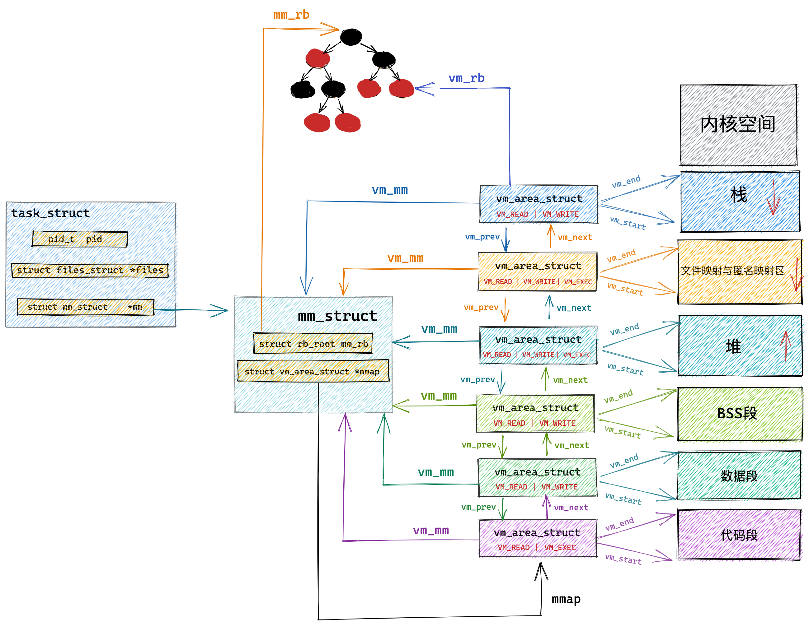 

当进程被创建完毕之后，在内核运行的过程中，会涉及内核栈的分配，内核会为每个进程分配一个固定大小的内核栈（一般是两个页大小，依赖具体的体系结构），每个进程的整个调用链必须放在自己的内核栈中，内核栈也是分配在直接映射区。

与进程用户空间中的栈不同的是，内核栈容量小而且是固定的，用户空间中的栈容量大而且可以动态扩展。内核栈的溢出危害非常巨大，它会直接悄无声息的覆盖相邻内存区域中的数据，破坏数据。

通过以上内容的介绍我们了解到内核虚拟内存空间最前边的这段 896M 大小的直接映射区如何与物理内存进行映射关联，并且清楚了直接映射区主要用来存放哪些内容。

写到这里，我觉得还是有必要再次从功能划分的角度为大家介绍下这块直接映射区域。

我们都知道内核对物理内存的管理都是以页为最小单位来管理的，每页默认 4K 大小，理想状况下任何种类的数据页都可以存放在任何页框中，没有什么限制。比如：存放内核数据，用户数据，缓冲磁盘数据等。

但是实际的计算机体系结构受到硬件方面的限制制约，间接导致限制了页框的使用方式。

比如在 X86 体系结构下，ISA 总线的 DMA （直接内存存取）控制器，只能对内存的前16M 进行寻址，这就导致了 ISA 设备不能在整个 32 位地址空间中执行 DMA，只能使用物理内存的前 16M 进行 DMA 操作。

因此直接映射区的前 16M 专门让内核用来为 DMA 分配内存，这块 16M 大小的内存区域我们称之为 ZONE_DMA。

> 用于 DMA 的内存必须从 ZONE_DMA 区域中分配。

而直接映射区中剩下的部分也就是从 16M 到 896M（不包含 896M）这段区域，我们称之为 ZONE_NORMAL。从字面意义上我们可以了解到，这块区域包含的就是正常的页框（使用没有任何限制）。

ZONE_NORMAL 由于也是属于直接映射区的一部分，对应的物理内存 16M 到 896M 这段区域也是被直接映射至内核态虚拟内存空间中的 3G + 16M 到 3G + 896M 这段虚拟内存上。

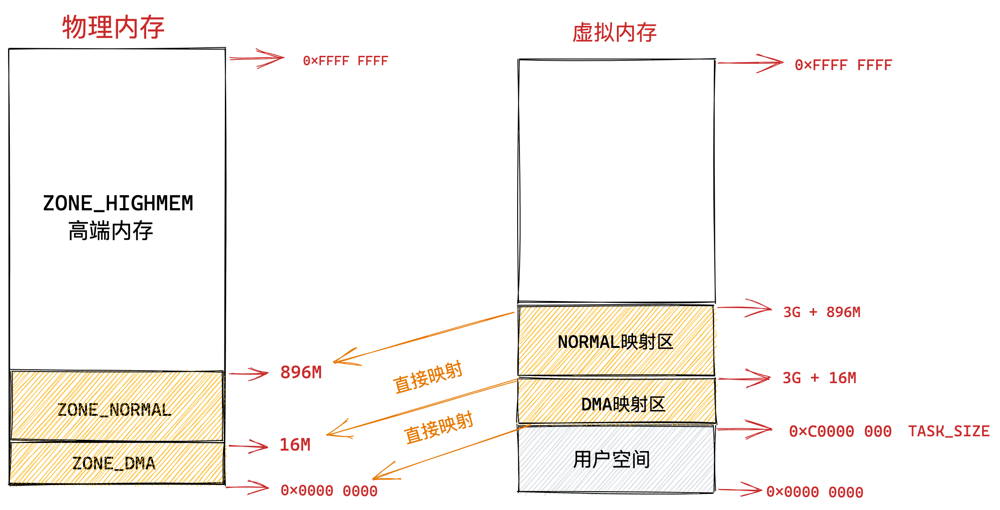 

> 注意这里的 ZONE_DMA 和 ZONE_NORMAL 是内核针对物理内存区域的划分。

现在物理内存中的前 896M 的区域也就是前边介绍的 ZONE_DMA 和 ZONE_NORMAL 区域到内核虚拟内存空间的映射我就为大家介绍完了，它们都是采用直接映射的方式，一比一就行映射。

### 1.2 ZONE_HIGHMEM 高端内存

而物理内存 896M 以上的区域被内核划分为 ZONE_HIGHMEM 区域，我们称之为高端内存。

本例中我们的物理内存假设为 4G，高端内存区域为 4G - 896M = 3200M，那么这块 3200M 大小的 ZONE_HIGHMEM 区域该如何映射到内核虚拟内存空间中呢？

由于内核虚拟内存空间中的前 896M 虚拟内存已经被直接映射区所占用，而在 32 体系结构下内核虚拟内存空间总共也就 1G 的大小，这样一来内核剩余可用的虚拟内存空间就变为了 1G - 896M = 128M。

显然物理内存中 3200M 大小的 ZONE_HIGHMEM 区域无法继续通过直接映射的方式映射到这 128M 大小的虚拟内存空间中。

这样一来物理内存中的 ZONE_HIGHMEM 区域就只能采用动态映射的方式映射到 128M 大小的内核虚拟内存空间中，也就是说只能动态的一部分一部分的分批映射，先映射正在使用的这部分，使用完毕解除映射，接着映射其他部分。

知道了 ZONE_HIGHMEM 区域的映射原理，我们接着往下看这 128M 大小的内核虚拟内存空间究竟是如何布局的？

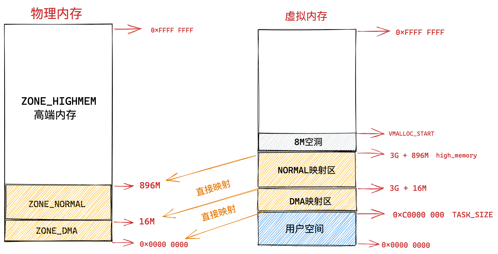 

内核虚拟内存空间中的 3G + 896M 这块地址在内核中定义为 high_memory，high_memory 往上有一段 8M 大小的内存空洞。空洞范围为：high_memory 到 VMALLOC_START 。

VMALLOC_START 定义在内核源码 `/arch/x86/include/asm/pgtable_32_areas.h` 文件中：

```c
#define VMALLOC_OFFSET	(8 * 1024 * 1024)

#define VMALLOC_START	((unsigned long)high_memory + VMALLOC_OFFSET)
```

### 1.3 vmalloc 动态映射区

接下来 VMALLOC_START 到 VMALLOC_END 之间的这块区域成为动态映射区。采用动态映射的方式映射物理内存中的高端内存。

```c
#ifdef CONFIG_HIGHMEM
# define VMALLOC_END	(PKMAP_BASE - 2 * PAGE_SIZE)
#else
# define VMALLOC_END	(LDT_BASE_ADDR - 2 * PAGE_SIZE)
#endif
```

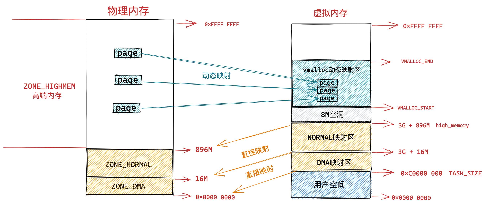 

和用户态进程使用 malloc 申请内存一样，在这块动态映射区内核是使用 vmalloc 进行内存分配。由于之前介绍的动态映射的原因，vmalloc 分配的内存在虚拟内存上是连续的，但是物理内存是不连续的。通过页表来建立物理内存与虚拟内存之间的映射关系，从而可以将不连续的物理内存映射到连续的虚拟内存上。

> 由于 vmalloc 获得的物理内存页是不连续的，因此它只能将这些物理内存页一个一个地进行映射，在性能开销上会比直接映射大得多。

关于 vmalloc 分配内存的相关实现原理，我会在后面的文章中为大家讲解，这里大家只需要明白它在哪块虚拟内存区域中活动即可。

### 1.4 永久映射区

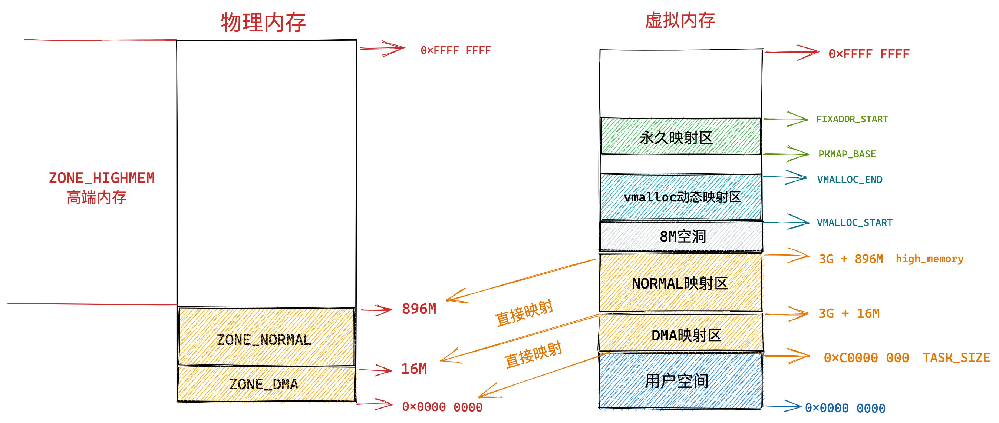 

而在 PKMAP_BASE 到 FIXADDR_START 之间的这段空间称为永久映射区。在内核的这段虚拟地址空间中允许建立与物理高端内存的长期映射关系。比如内核通过 alloc_pages() 函数在物理内存的高端内存中申请获取到的物理内存页，这些物理内存页可以通过调用 kmap 映射到永久映射区中。

> LAST_PKMAP 表示永久映射区可以映射的页数限制。

```c
#define PKMAP_BASE		\
	((LDT_BASE_ADDR - PAGE_SIZE) & PMD_MASK)

#define LAST_PKMAP 1024
```

### 1.5 固定映射区

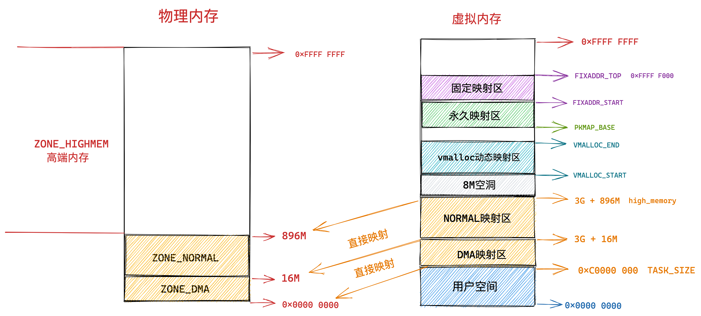 

内核虚拟内存空间中的下一个区域为固定映射区，区域范围为：FIXADDR_START 到 FIXADDR_TOP。

FIXADDR_START 和 FIXADDR_TOP 定义在内核源码 `/arch/x86/include/asm/fixmap.h` 文件中：

```c
#define FIXADDR_START		(FIXADDR_TOP - FIXADDR_SIZE)

extern unsigned long __FIXADDR_TOP; // 0xFFFF F000
#define FIXADDR_TOP	((unsigned long)__FIXADDR_TOP)
```

在内核虚拟内存空间的直接映射区中，直接映射区中的虚拟内存地址与物理内存前 896M 的空间的映射关系都是预设好的，一比一映射。

在固定映射区中的虚拟内存地址可以自由映射到物理内存的高端地址上，但是与动态映射区以及永久映射区不同的是，在固定映射区中虚拟地址是固定的，而被映射的物理地址是可以改变的。也就是说，有些虚拟地址在编译的时候就固定下来了，是在内核启动过程中被确定的，而这些虚拟地址对应的物理地址不是固定的。采用固定虚拟地址的好处是它相当于一个指针常量（常量的值在编译时确定），指向物理地址，如果虚拟地址不固定，则相当于一个指针变量。

那为什么会有固定映射这个概念呢 ? 比如：在内核的启动过程中，有些模块需要使用虚拟内存并映射到指定的物理地址上，而且这些模块也没有办法等待完整的内存管理模块初始化之后再进行地址映射。因此，内核固定分配了一些虚拟地址，这些地址有固定的用途，使用该地址的模块在初始化的时候，将这些固定分配的虚拟地址映射到指定的物理地址上去。

### 1.6 临时映射区

在内核虚拟内存空间中的最后一块区域为临时映射区，那么这块临时映射区是用来干什么的呢？

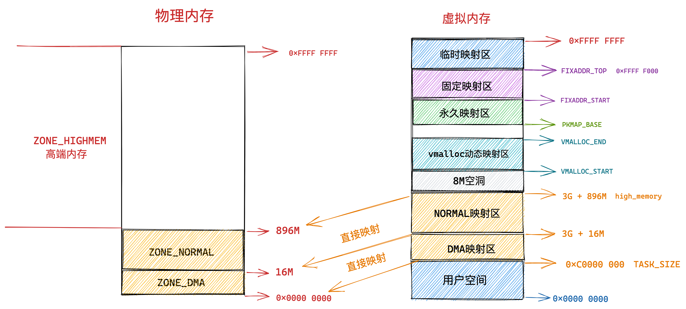 

我在之前文章 [《从 Linux 内核角度探秘 JDK NIO 文件读写本质》 (opens new window)](https://mp.weixin.qq.com/s?__biz=Mzg2MzU3Mjc3Ng==&mid=2247486623&idx=1&sn=0cafed9e89b60d678d8c88dc7689abda&chksm=ce77cad8f90043ceaaca732aaaa7cb692c1d23eeb6c07de84f0ad690ab92d758945807239cee&token=1276722624&lang=zh_CN#rd)的 “ 12.3 iov_iter_copy_from_user_atomic ” 小节中介绍在 Buffered IO 模式下进行文件写入的时候，在下图中的第四步，内核会调用 iov_iter_copy_from_user_atomic 函数将用户空间缓冲区 DirectByteBuffer 中的待写入数据拷贝到 page cache 中。

 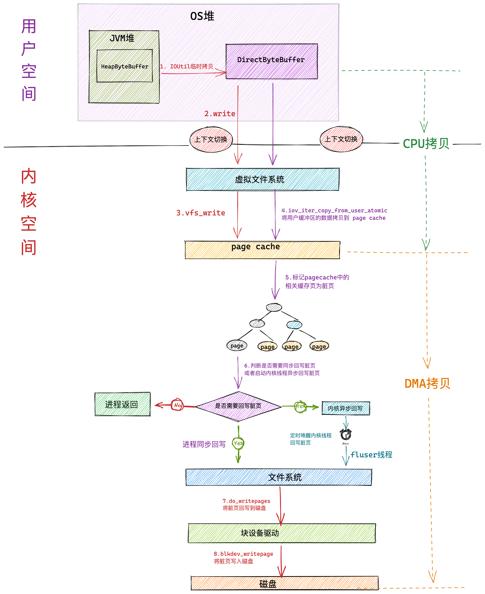 

但是内核又不能直接进行拷贝，因为此时从 page cache 中取出的缓存页 page 是物理地址，而在内核中是不能够直接操作物理地址的，只能操作虚拟地址。

那怎么办呢？所以就需要使用 kmap_atomic 将缓存页临时映射到内核空间的一段虚拟地址上，这段虚拟地址就位于内核虚拟内存空间中的临时映射区上，然后将用户空间缓存区 DirectByteBuffer 中的待写入数据通过这段映射的虚拟地址拷贝到 page cache 中的相应缓存页中。这时文件的写入操作就已经完成了。

由于是临时映射，所以在拷贝完成之后，调用 kunmap_atomic 将这段映射再解除掉。

```c
size_t iov_iter_copy_from_user_atomic(struct page *page,
    struct iov_iter *i, unsigned long offset, size_t bytes)
{
  // 将缓存页临时映射到内核虚拟地址空间的临时映射区中
  char *kaddr = kmap_atomic(page), 
  *p = kaddr + offset;
  // 将用户缓存区 DirectByteBuffer 中的待写入数据拷贝到文件缓存页中
  iterate_all_kinds(i, bytes, v,
    copyin((p += v.iov_len) - v.iov_len, v.iov_base, v.iov_len),
    memcpy_from_page((p += v.bv_len) - v.bv_len, v.bv_page,
         v.bv_offset, v.bv_len),
    memcpy((p += v.iov_len) - v.iov_len, v.iov_base, v.iov_len)
  )
  // 解除内核虚拟地址空间与缓存页之间的临时映射，这里映射只是为了临时拷贝数据用
  kunmap_atomic(kaddr);
  return bytes;
}
```

### 1.7 32位体系结构下 Linux 虚拟内存空间整体布局

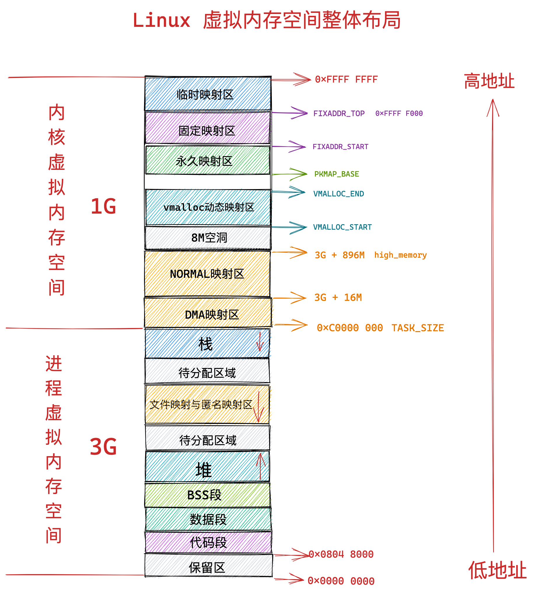 

## 2. 64 位体系内核虚拟内存空间布局

### 2.1 基础

内核虚拟内存空间在 32 位体系下只有 1G 大小，实在太小了，因此需要精细化的管理，于是按照功能分类划分除了很多内核虚拟内存区域，这样就显得非常复杂。

到了 64 位体系下，内核虚拟内存空间的布局和管理就变得容易多了，因为进程虚拟内存空间和内核虚拟内存空间各自占用 128T 的虚拟内存，实在是太大了，我们可以在这里边随意翱翔，随意挥霍。

因此在 64 位体系下的内核虚拟内存空间与物理内存的映射就变得非常简单，由于虚拟内存空间足够的大，即便是内核要访问全部的物理内存，直接映射就可以了，不在需要用到《7.1.2 ZONE_HIGHMEM 高端内存》小节中介绍的高端内存那种动态映射方式。

在前边《5.1 内核如何划分用户态和内核态虚拟内存空间》小节中我们提到，内核在 `/arch/x86/include/asm/page_64_types.h` 文件中通过 TASK_SIZE 将进程虚拟内存空间和内核虚拟内存空间分割开来。

```c
#define TASK_SIZE		(test_thread_flag(TIF_ADDR32) ? \
					IA32_PAGE_OFFSET : TASK_SIZE_MAX)

#define TASK_SIZE_MAX		task_size_max()

#define task_size_max()		((_AC(1,UL) << __VIRTUAL_MASK_SHIFT) - PAGE_SIZE)

#define __VIRTUAL_MASK_SHIFT	47
```

> 64 位系统中的 TASK_SIZE 为 0x00007FFFFFFFF000

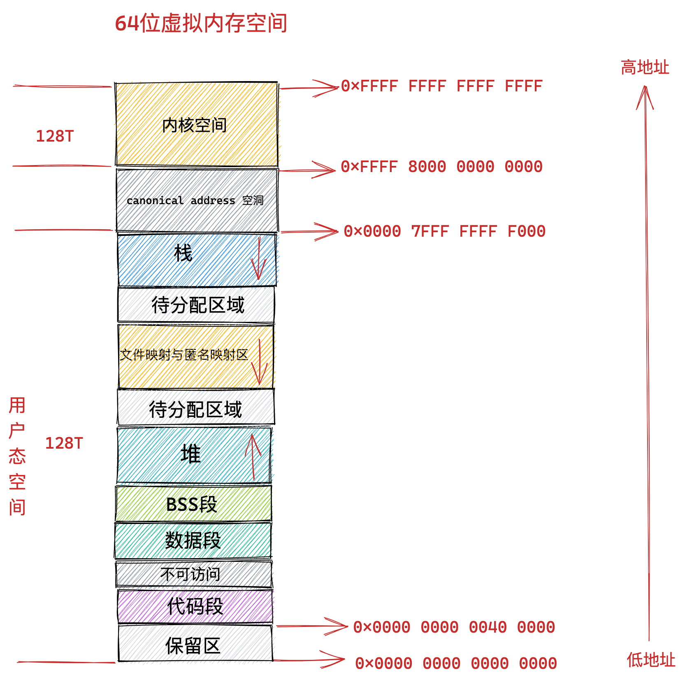 

在 64 位系统中，只使用了其中的低 48 位来表示虚拟内存地址。其中用户态虚拟内存空间为低 128 T，虚拟内存地址范围为：0x0000 0000 0000 0000 - 0x0000 7FFF FFFF F000 。

内核态虚拟内存空间为高 128 T，虚拟内存地址范围为：0xFFFF 8000 0000 0000 - 0xFFFF FFFF FFFF FFFF 。

本小节我们主要关注 0xFFFF 8000 0000 0000 - 0xFFFF FFFF FFFF FFFF 这段内核虚拟内存空间的布局情况。

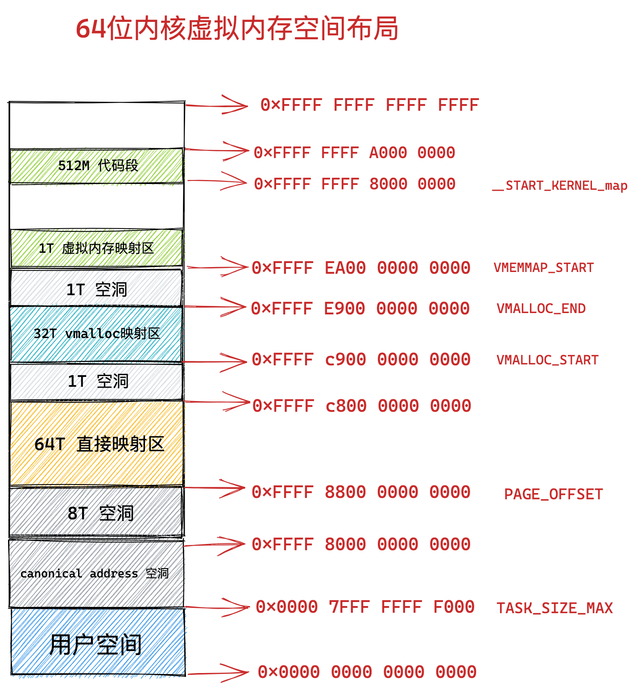 

（1）64 位内核虚拟内存空间从 0xFFFF 8000 0000 0000 开始到 0xFFFF 8800 0000 0000 这段地址空间是一个 8T 大小的内存空洞区域。

（2）紧着着 8T 大小的内存空洞下一个区域就是 64T 大小的直接映射区。这个区域中的虚拟内存地址减去 PAGE_OFFSET 就直接得到了物理内存地址。

PAGE_OFFSET 变量定义在 `/arch/x86/include/asm/page_64_types.h` 文件中：

```c
#define __PAGE_OFFSET_BASE      _AC(0xffff880000000000, UL)
#define __PAGE_OFFSET           __PAGE_OFFSET_BASE
```

（3）从图中 VMALLOC_START 到 VMALLOC_END 的这段区域是 32T 大小的 vmalloc 映射区，这里类似用户空间中的堆，内核在这里使用 vmalloc 系统调用申请内存。

VMALLOC_START 和 VMALLOC_END 变量定义在 `/arch/x86/include/asm/pgtable_64_types.h` 文件中：

```c
#define __VMALLOC_BASE_L4	0xffffc90000000000UL

#define VMEMMAP_START		__VMEMMAP_BASE_L4

#define VMALLOC_END		(VMALLOC_START + (VMALLOC_SIZE_TB << 40) - 1)
```

（4）从 VMEMMAP_START 开始是 1T 大小的虚拟内存映射区，用于存放物理页面的描述符 struct page 结构用来表示物理内存页。

VMEMMAP_START 变量定义在 `/arch/x86/include/asm/pgtable_64_types.h` 文件中：

```c
#define __VMEMMAP_BASE_L4	0xffffea0000000000UL

# define VMEMMAP_START		__VMEMMAP_BASE_L4
```

（5）从 __START_KERNEL_map 开始是大小为 512M 的区域用于存放内核代码段、全局变量、BSS 等。这里对应到物理内存开始的位置，减去 __START_KERNEL_map 就能得到物理内存的地址。这里和直接映射区有点像，但是不矛盾，因为直接映射区之前有 8T 的空洞区域，早就过了内核代码在物理内存中加载的位置。

__START_KERNEL_map 变量定义在 `/arch/x86/include/asm/page_64_types.h` 文件中：

```c
#define __START_KERNEL_map  _AC(0xffffffff80000000, UL)
```

### 2.2 64位体系结构下 Linux 虚拟内存空间整体布局

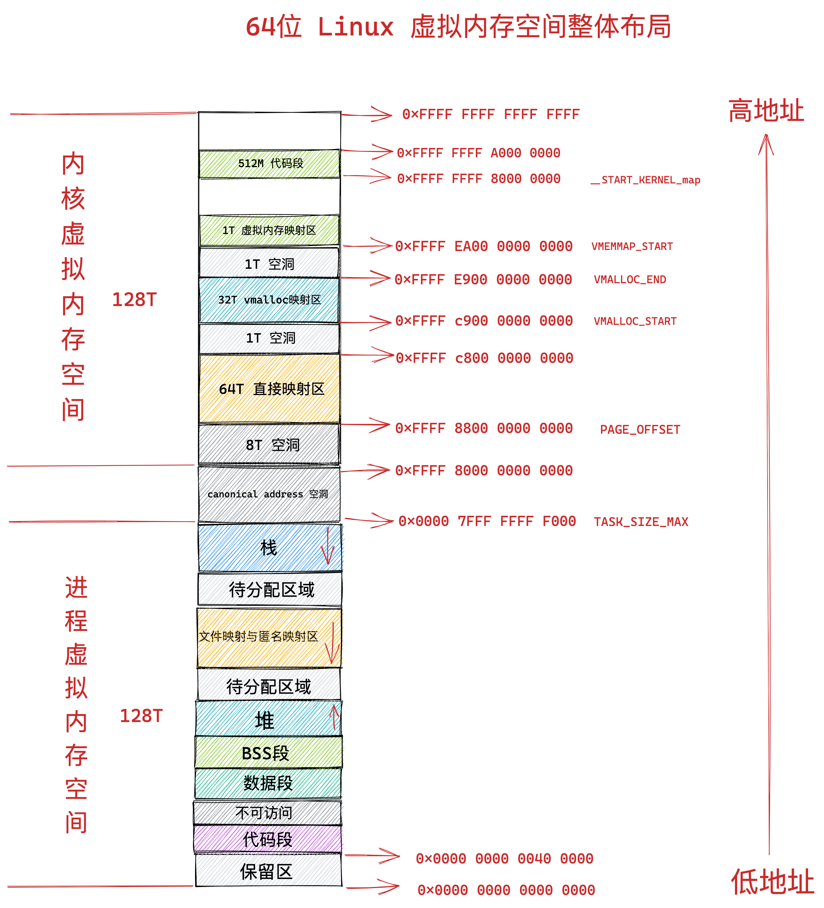 


