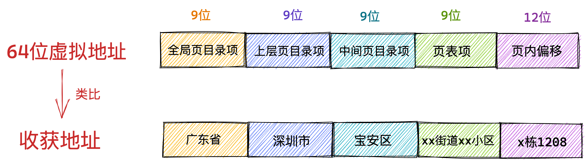
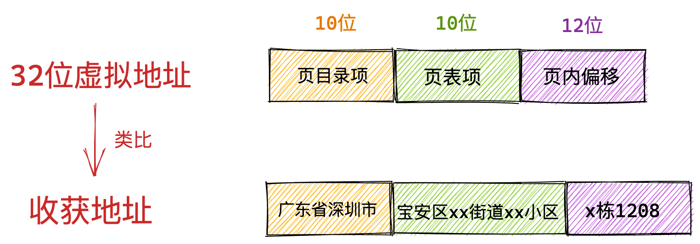
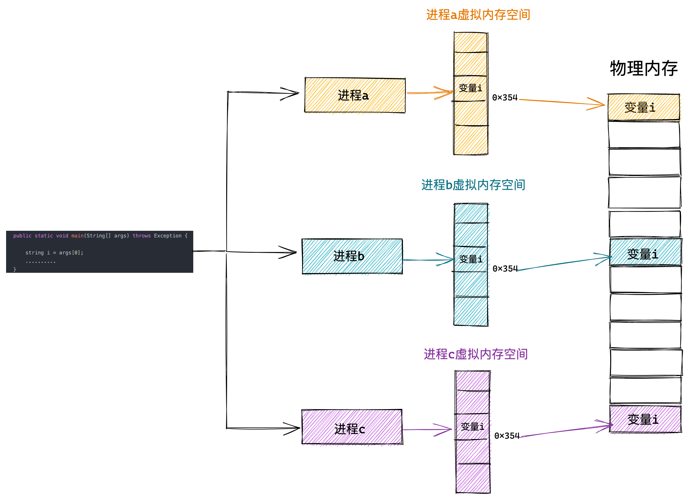

# 引入

## 1. 什么是虚拟内存地址

我们以 Intel Core i7 处理器为例，64 位虚拟地址的格式为：全局页目录项（9位）+ 上层页目录项（9位）+ 中间页目录项（9位）+ 页表项（9位）+ 页内偏移（12位）。共 48 位组成的虚拟内存地址。

 

+ VPN
  + pgd
  + pud
  + pmd
  + pte
+ VPO

32 位虚拟地址的格式为：页目录项（10位）+ 页表项（10位） + 页内偏移（12位）。共 32 位组成的虚拟内存地址。

 

> 进程虚拟内存空间中的每一个字节都有与其对应的虚拟内存地址，一个虚拟内存地址表示进程虚拟内存空间中的一个特定的字节。

## 2. 为什么要使用虚拟地址访问内存

在直接操作物理内存的情况下，我们需要知道每一个变量的位置都被安排在了哪里，而且还要注意和多个进程同时运行的时候，不能共用同一个地址，否则就会造成地址冲突。

现实中一个程序会有很多的变量和函数，这样一来我们给它们都需要计算一个合理的位置，还不能与其他进程冲突，这就很复杂了。

那么我们该如何解决这个问题呢？程序的局部性原理再一次救了我们~~

> 程序局部性原理表现为：时间局部性和空间局部性。时间局部性是指如果程序中的某条指令一旦执行，则不久之后该指令可能再次被执行；如果某块数据被访问，则不久之后该数据可能再次被访问。空间局部性是指一旦程序访问了某个存储单元，则不久之后，其附近的存储单元也将被访问。

从程序局部性原理的描述中我们可以得出这样一个结论：进程在运行之后，对于内存的访问不会一下子就要访问全部的内存，相反进程对于内存的访问会表现出明显的倾向性，更加倾向于访问最近访问过的数据以及热点数据附近的数据。

根据这个结论我们就清楚了，无论一个进程实际可以占用的内存资源有多大，根据程序局部性原理，在某一段时间内，进程真正需要的物理内存其实是很少的一部分，我们只需要为每个进程分配很少的物理内存就可以保证进程的正常执行运转。

而虚拟内存的引入正是要解决上述的问题，虚拟内存引入之后，进程的视角就会变得非常开阔，每个进程都拥有自己独立的虚拟地址空间，进程与进程之间的虚拟内存地址空间是相互隔离，互不干扰的。每个进程都认为自己独占所有内存空间，自己想干什么就干什么。

系统上还运行了哪些进程和我没有任何关系。这样一来我们就可以将多进程之间协同的相关复杂细节统统交给内核中的内存管理模块来处理，极大地解放了程序员的心智负担。这一切都是因为虚拟内存能够提供内存地址空间的隔离，极大地扩展了可用空间。

 

这样进程就以为自己独占了整个内存空间资源，给进程产生了所有内存资源都属于它自己的幻觉，这其实是 CPU 和操作系统使用的一个障眼法罢了，任何一个虚拟内存里所存储的数据，本质上还是保存在真实的物理内存里的。只不过内核帮我们做了虚拟内存到物理内存的这一层映射，将不同进程的虚拟地址和不同内存的物理地址映射起来。

当 CPU 访问进程的虚拟地址时，经过地址翻译硬件将虚拟地址转换成不同的物理地址，这样不同的进程运行的时候，虽然操作的是同一虚拟地址，但其实背后写入的是不同的物理地址，这样就不会冲突了。 

