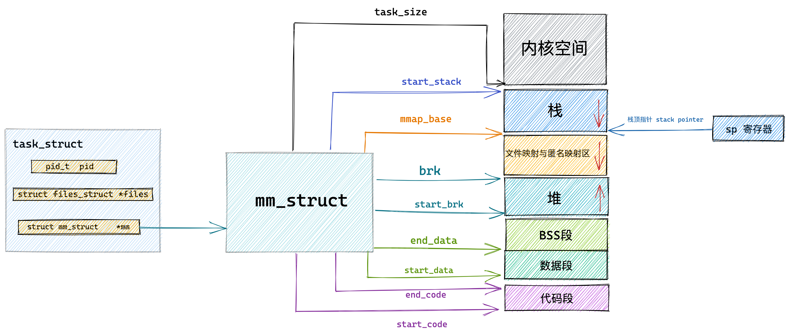

# 程序编译后的二进制文件如何映射到虚拟内存空间中

 

我们写的程序代码编译之后会生成一个 ELF 格式的二进制文件，这个二进制文件中包含了程序运行时所需要的元信息，比如程序的机器码，程序中的全局变量以及静态变量等。

这个 ELF 格式的二进制文件中的布局和我们前边讲的虚拟内存空间中的布局类似，也是一段一段的，每一段包含了不同的元数据。

> 磁盘文件中的段我们叫做 Section，内存中的段我们叫做 Segment，也就是内存区域。

磁盘文件中的这些 Section 会在进程运行之前加载到内存中并映射到内存中的 Segment。通常是多个 Section 映射到一个 Segment。

比如磁盘文件中的 `.text`，`.rodata` 等一些只读的 Section，会被映射到内存的一个只读可执行的 Segment 里（代码段）。而 `.data`，`.bss` 等一些可读写的 Section，则会被映射到内存的一个具有读写权限的 Segment 里（数据段，BSS 段）。

那么这些 ELF 格式的二进制文件中的 Section 是如何加载并映射进虚拟内存空间的呢？

内核中完成这个映射过程的函数是 load_elf_binary ，这个函数的作用很大，加载内核的是它，启动第一个用户态进程 init 的是它，fork 完了以后，调用 exec 运行一个二进制程序的也是它。当 exec 运行一个二进制程序的时候，除了解析 ELF 的格式之外，另外一个重要的事情就是建立上述提到的内存映射。

```c
static int load_elf_binary(struct linux_binprm *bprm)
{
      ...... 省略 ........
  // 设置虚拟内存空间中的内存映射区域起始地址 mmap_base
  setup_new_exec(bprm);

     ...... 省略 ........
  // 创建并初始化栈对应的 vm_area_struct 结构。
  // 设置 mm->start_stack 就是栈的起始地址也就是栈底，并将 mm->arg_start 是指向栈底的。
  retval = setup_arg_pages(bprm, randomize_stack_top(STACK_TOP),
         executable_stack);

     ...... 省略 ........
  // 将二进制文件中的代码部分映射到虚拟内存空间中
  error = elf_map(bprm->file, load_bias + vaddr, elf_ppnt,
        elf_prot, elf_flags, total_size);

     ...... 省略 ........
 // 创建并初始化堆对应的的 vm_area_struct 结构
 // 设置 current->mm->start_brk = current->mm->brk，设置堆的起始地址 start_brk，结束地址 brk。 起初两者相等表示堆是空的
  retval = set_brk(elf_bss, elf_brk, bss_prot);

     ...... 省略 ........
  // 将进程依赖的动态链接库 .so 文件映射到虚拟内存空间中的内存映射区域
  elf_entry = load_elf_interp(&loc->interp_elf_ex,
              interpreter,
              &interp_map_addr,
              load_bias, interp_elf_phdata);

     ...... 省略 ........
  // 初始化内存描述符 mm_struct
  current->mm->end_code = end_code;
  current->mm->start_code = start_code;
  current->mm->start_data = start_data;
  current->mm->end_data = end_data;
  current->mm->start_stack = bprm->p;

     ...... 省略 ........
}
```

- setup_new_exec 设置虚拟内存空间中的内存映射区域起始地址 mmap_base
- setup_arg_pages 创建并初始化栈对应的 vm_area_struct 结构。置 mm->start_stack 就是栈的起始地址也就是栈底，并将 mm->arg_start 是指向栈底的。
- elf_map 将 ELF 格式的二进制文件中`.text` ，`.data`，`.bss` 部分映射到虚拟内存空间中的代码段，数据段，BSS 段中。
- set_brk 创建并初始化堆对应的的 vm_area_struct 结构，设置 `current->mm->start_brk = current->mm->brk`，设置堆的起始地址 start_brk，结束地址 brk。 起初两者相等表示堆是空的。
- load_elf_interp 将进程依赖的动态链接库 `.so` 文件映射到虚拟内存空间中的内存映射区域
- 初始化内存描述符 mm_struct

