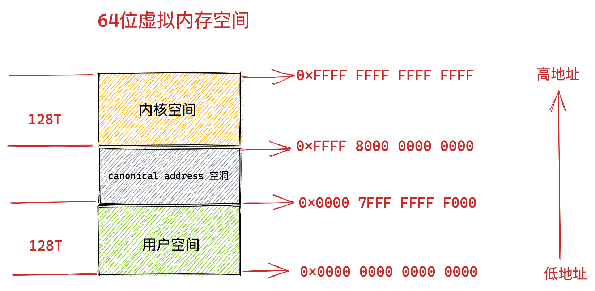
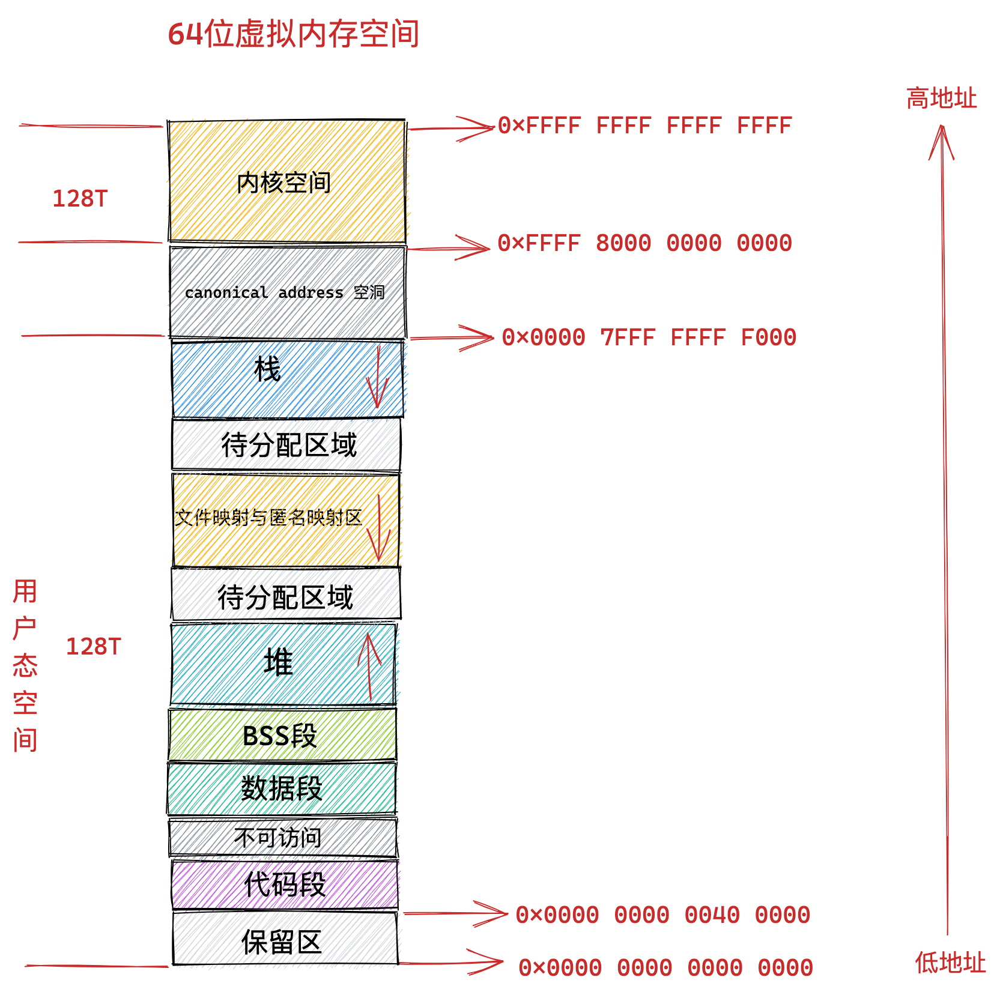

# 进程虚拟内存空间

## 1. 进程的大致样子

 

- 用于存放进程程序二进制文件中的机器指令的代码段
- 用于存放程序二进制文件中定义的全局变量和静态变量的数据段和 BSS 段。
- 用于在程序运行过程中动态申请内存的堆。
- 用于存放动态链接库以及内存映射区域的文件映射与匿名映射区。
- 用于存放函数调用过程中的局部变量和函数参数的栈。

## 2. Linux 进程虚拟内存空间

### 2.1 32 位机器上进程虚拟内存空间分布

在 32 位机器上，指针的寻址范围为 2^32，所能表达的虚拟内存空间为 4 GB。所以在 32 位机器上进程的虚拟内存地址范围为：0x0000 0000 - 0xFFFF FFFF。

其中用户态虚拟内存空间为 3 GB，虚拟内存地址范围为：0x0000 0000 - 0xC000 000 。

内核态虚拟内存空间为 1 GB，虚拟内存地址范围为：0xC000 000 - 0xFFFF FFFF。

 

但是用户态虚拟内存空间中的代码段并不是从 0x0000 0000 地址开始的，而是从 0x0804 8000 地址开始。

0x0000 0000 到 0x0804 8000 这段虚拟内存地址是一段不可访问的保留区，因为在大多数操作系统中，数值比较小的地址通常被认为不是一个合法的地址，这块小地址是不允许访问的。比如在 C 语言中我们通常会将一些无效的指针设置为 NULL，指向这块不允许访问的地址。

保留区的上边就是代码段和数据段，它们是从程序的二进制文件中直接加载进内存中的，BSS 段中的数据也存在于二进制文件中，因为内核知道这些数据是没有初值的，所以在二进制文件中只会记录 BSS 段的大小，在加载进内存时会生成一段 0 填充的内存空间。

紧挨着 BSS 段的上边就是我们经常使用到的堆空间，从图中的红色箭头我们可以知道在堆空间中地址的增长方向是从低地址到高地址增长。

内核中使用 start_brk 标识堆的起始位置，brk 标识堆当前的结束位置。当堆申请新的内存空间时，只需要将 brk 指针增加对应的大小，回收地址时减少对应的大小即可。比如当我们通过 malloc 向内核申请很小的一块内存时（128K 之内），就是通过改变 brk 位置实现的。

堆空间的上边是一段待分配区域，用于扩展堆空间的使用。接下来就来到了文件映射与匿名映射区域。进程运行时所依赖的动态链接库中的代码段，数据段，BSS 段就加载在这里。还有我们调用 mmap 映射出来的一段虚拟内存空间也保存在这个区域。**注意：在文件映射与匿名映射区的地址增长方向是从高地址向低地址增长**。

接下来用户态虚拟内存空间的最后一块区域就是栈空间了，在这里会保存函数运行过程所需要的局部变量以及函数参数等函数调用信息。**栈空间中的地址增长方向是从高地址向低地址增长**。每次进程申请新的栈地址时，其地址值是在减少的。

在内核中使用 start_stack 标识栈的起始位置，RSP 寄存器中保存栈顶指针 stack pointer，RBP 寄存器中保存的是栈基地址。

在栈空间的下边也有一段待分配区域用于扩展栈空间，在栈空间的上边就是内核空间了，进程虽然可以看到这段内核空间地址，但是就是不能访问。这就好比我们在饭店里虽然可以看到厨房在哪里，但是厨房门上写着 “厨房重地，闲人免进” ，我们就是进不去。

### 2.2 64 位机器上进程虚拟内存空间分布

上小节中介绍的 32 位虚拟内存空间布局和本小节即将要介绍的 64 位虚拟内存空间布局都可以通过 `cat /proc/pid/maps` 或者 `pmap pid` 来查看某个进程的实际虚拟内存布局。

我们知道在 32 位机器上，指针的寻址范围为 2^32，所能表达的虚拟内存空间为 4 GB。

那么我们理所应当的会认为在 64 位机器上，指针的寻址范围为 2^64，所能表达的虚拟内存空间为 16 EB 。虚拟内存地址范围为：0x0000 0000 0000 0000 0000 - 0xFFFF FFFF FFFF FFFF 。

好家伙 !!! 16 EB 的内存空间，我都没见过这么大的磁盘，在现实情况中根本不会用到这么大范围的内存空间，

事实上在目前的 64 位系统下只使用了 48 位来描述虚拟内存空间，寻址范围为 2^48 ，所能表达的虚拟内存空间为 256TB。

其中低 128 T 表示用户态虚拟内存空间，虚拟内存地址范围为：0x0000 0000 0000 0000 - 0x0000 7FFF FFFF F000 。

高 128 T 表示内核态虚拟内存空间，虚拟内存地址范围为：0xFFFF 8000 0000 0000 - 0xFFFF FFFF FFFF FFFF 。

这样一来就在用户态虚拟内存空间与内核态虚拟内存空间之间形成了一段 0x0000 7FFF FFFF F000 - 0xFFFF 8000 0000 0000 的地址空洞，我们把这个空洞叫做 canonical address 空洞。

 

那么这个 canonical address 空洞是如何形成的呢？

我们都知道在 64 位机器上的指针寻址范围为 2^64，但是在实际使用中我们只使用了其中的低 48 位来表示虚拟内存地址，那么这多出的高 16 位就形成了这个地址空洞。

大家注意到在低 128T 的用户态地址空间：0x0000 0000 0000 0000 - 0x0000 7FFF FFFF F000 范围中，所以虚拟内存地址的高 16 位全部为 0 。

如果一个虚拟内存地址的高 16 位全部为 0 ，那么我们就可以直接判断出这是一个用户空间的虚拟内存地址。

同样的道理，在高 128T 的内核态虚拟内存空间：0xFFFF 8000 0000 0000 - 0xFFFF FFFF FFFF FFFF 范围中，所以虚拟内存地址的高 16 位全部为 1 。

也就是说内核态的虚拟内存地址的高 16 位全部为 1 ，如果一个试图访问内核的虚拟地址的高 16 位不全为 1 ，则可以快速判断这个访问是非法的。

这个高 16 位的空闲地址被称为 canonical 。如果虚拟内存地址中的高 16 位全部为 0 （表示用户空间虚拟内存地址）或者全部为 1 （表示内核空间虚拟内存地址），这种地址的形式我们叫做 canonical form，对应的地址我们称作 canonical address 。

那么处于 canonical address 空洞 ：0x0000 7FFF FFFF F000 - 0xFFFF 8000 0000 0000 范围内的地址的高 16 位 不全为 0 也不全为 1 。如果某个虚拟地址落在这段 canonical address 空洞区域中，那就是既不在用户空间，也不在内核空间，肯定是非法访问了。

未来我们也可以利用这块 canonical address 空洞，来扩展虚拟内存地址的范围，比如扩展到 56 位。

在我们理解了 canonical address 这个概念之后，我们再来看下 64 位 Linux 系统下的真实虚拟内存空间布局情况：

 

从上图中我们可以看出 64 位系统中的虚拟内存布局和 32 位系统中的虚拟内存布局大体上是差不多的。主要不同的地方有三点：

1. 就是前边提到的由高 16 位空闲地址造成的 canonical address 空洞。在这段范围内的虚拟内存地址是不合法的，因为它的高 16 位既不全为 0 也不全为 1，不是一个 canonical address，所以称之为 canonical address 空洞。
2. 在代码段跟数据段的中间还有一段不可以读写的保护段，它的作用是防止程序在读写数据段的时候越界访问到代码段，这个保护段可以让越界访问行为直接崩溃，防止它继续往下运行。
3. 用户态虚拟内存空间与内核态虚拟内存空间分别占用 128T，其中低128T 分配给用户态虚拟内存空间，高 128T 分配给内核态虚拟内存空间。