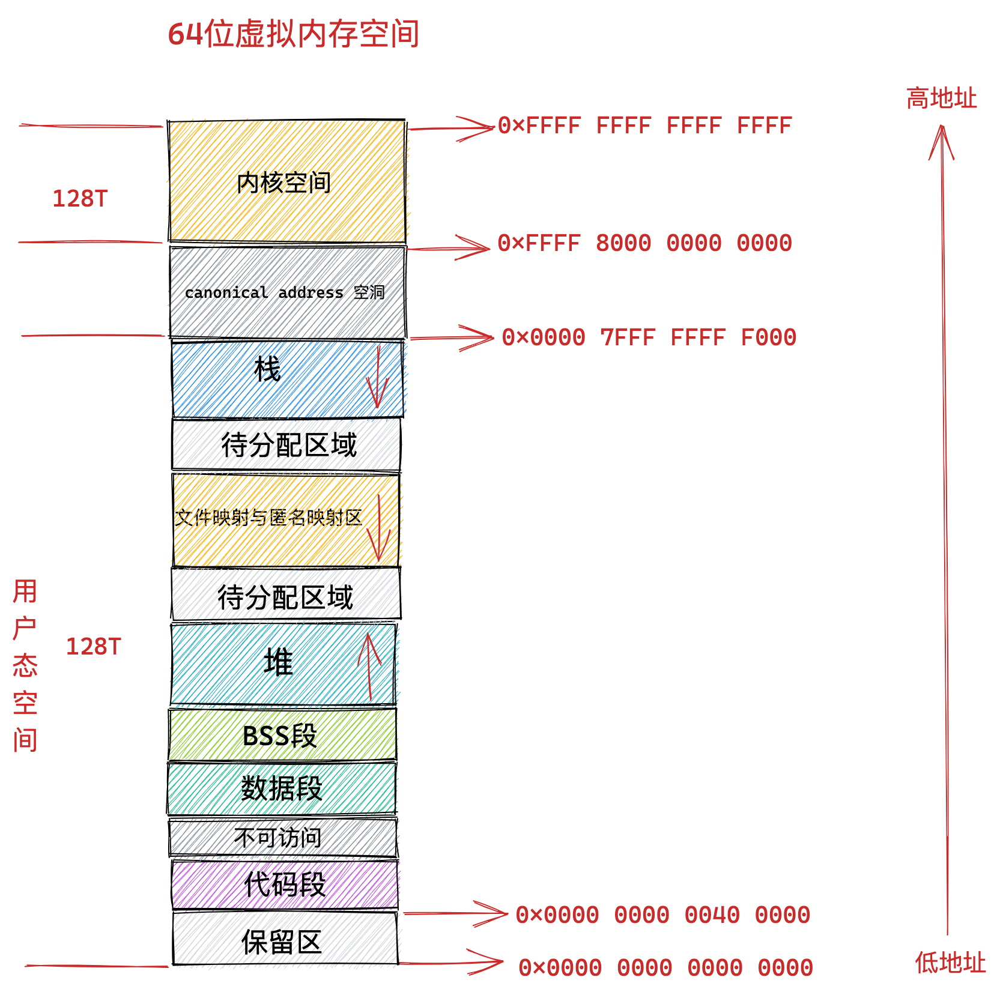
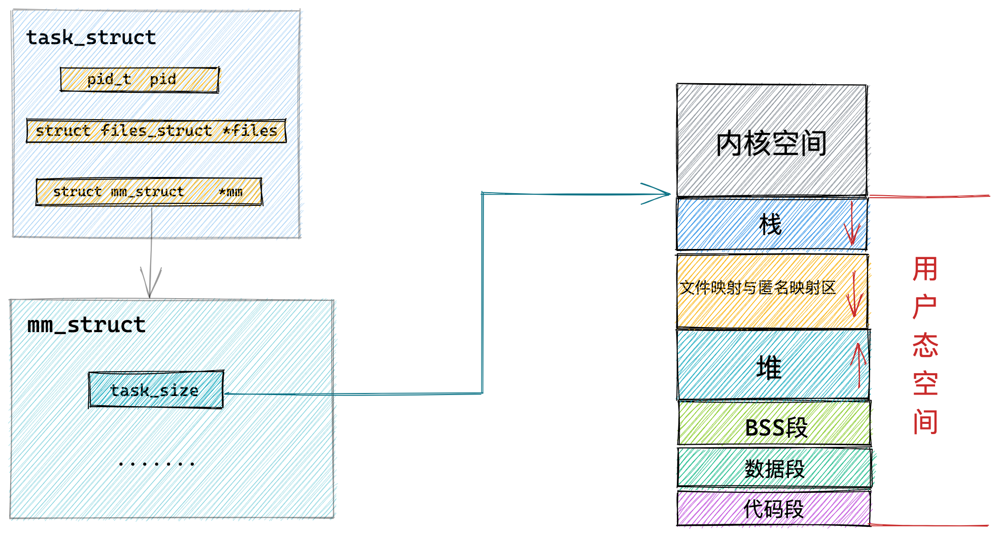
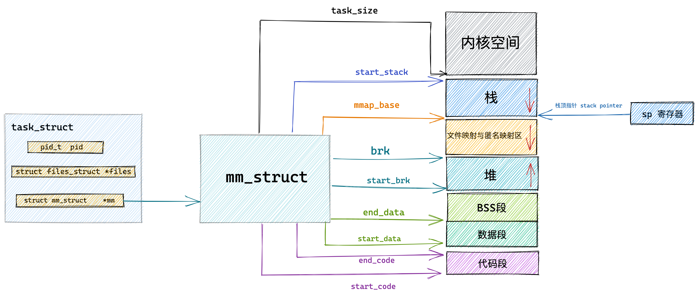
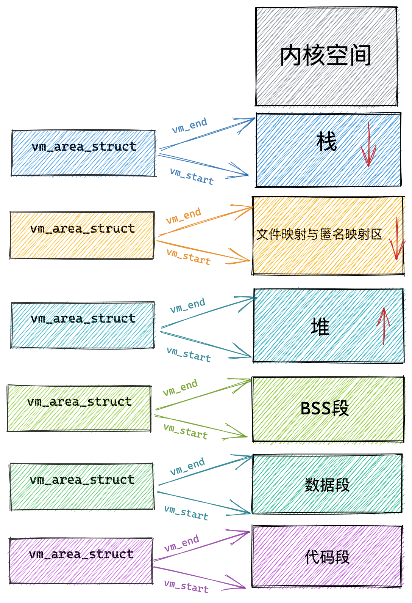
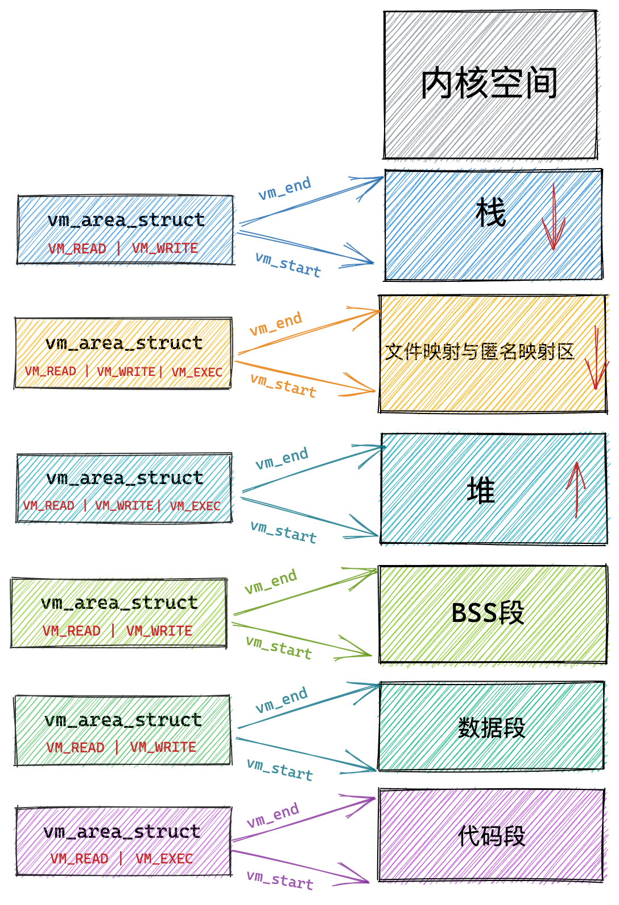
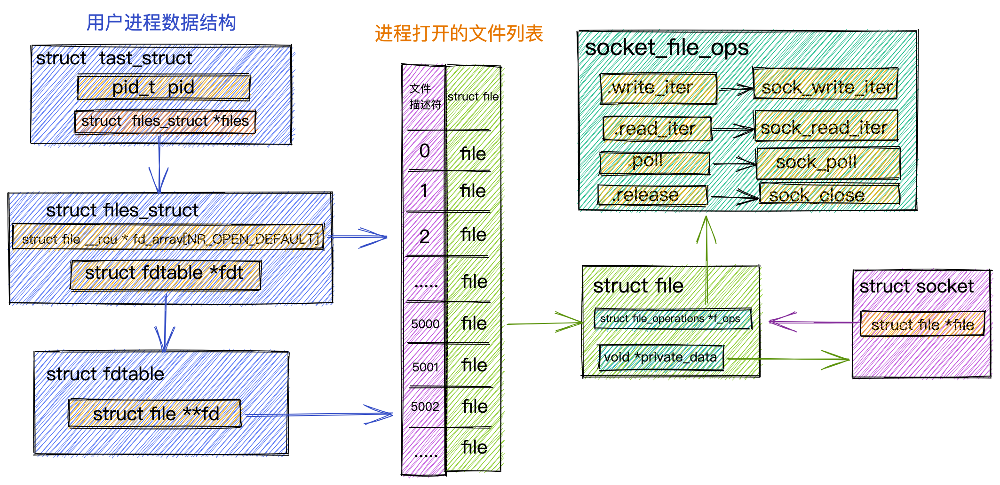
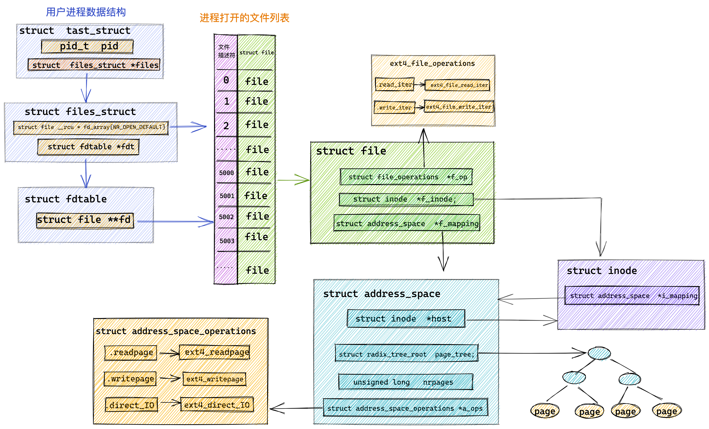
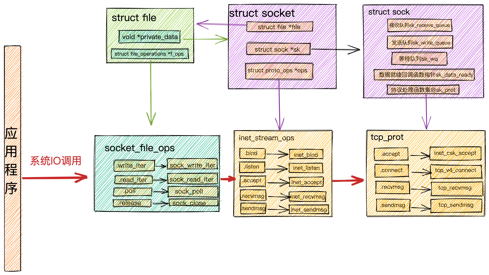
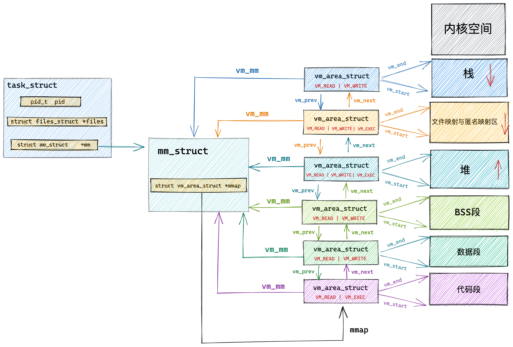
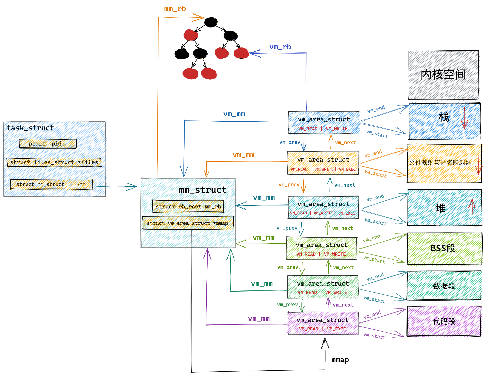

# 进程虚拟内存空间的管理

## 1. 引入

既然我们要介绍进程的虚拟内存空间管理，那就离不开进程在内核中的描述符 task_struct 结构。

```c
struct task_struct {
        // 进程id
	    pid_t				pid;
        // 用于标识线程所属的进程 pid
	    pid_t				tgid;
        // 进程打开的文件信息
        struct files_struct		*files;
        // 内存描述符表示进程虚拟地址空间
        struct mm_struct		*mm;

        .......... 省略 .......
}
```

在进程描述符 task_struct 结构中，有一个专门描述进程虚拟地址空间的内存描述符 mm_struct 结构，这个结构体中包含了前边几个小节中介绍的进程虚拟内存空间的全部信息。

每个进程都有唯一的 mm_struct 结构体，也就是前边提到的每个进程的虚拟地址空间都是独立，互不干扰的。

当我们调用 fork() 函数创建进程的时候，表示进程地址空间的 mm_struct 结构会随着进程描述符 task_struct 的创建而创建。

```c
long _do_fork(unsigned long clone_flags,
	      unsigned long stack_start,
	      unsigned long stack_size,
	      int __user *parent_tidptr,
	      int __user *child_tidptr,
	      unsigned long tls)
{
        ......... 省略 ..........
	struct pid *pid;
	struct task_struct *p;

        ......... 省略 ..........
    // 为进程创建 task_struct 结构，用父进程的资源填充 task_struct 信息
	p = copy_process(clone_flags, stack_start, stack_size,
			 child_tidptr, NULL, trace, tls, NUMA_NO_NODE);

         ......... 省略 ..........
}
```

随后会在 copy_process 函数中创建 task_struct 结构，并拷贝父进程的相关资源到新进程的 task_struct 结构里，其中就包括拷贝父进程的虚拟内存空间 mm_struct 结构。**这里可以看出子进程在新创建出来之后它的虚拟内存空间是和父进程的虚拟内存空间一模一样的，直接拷贝过来**。

```c
static __latent_entropy struct task_struct *copy_process(
					unsigned long clone_flags,
					unsigned long stack_start,
					unsigned long stack_size,
					int __user *child_tidptr,
					struct pid *pid,
					int trace,
					unsigned long tls,
					int node)
{

    struct task_struct *p;
    // 创建 task_struct 结构
    p = dup_task_struct(current, node);

        ....... 初始化子进程 ...........

        ....... 开始继承拷贝父进程资源  .......      
    // 继承父进程打开的文件描述符
	retval = copy_files(clone_flags, p);
    // 继承父进程所属的文件系统
	retval = copy_fs(clone_flags, p);
    // 继承父进程注册的信号以及信号处理函数
	retval = copy_sighand(clone_flags, p);
	retval = copy_signal(clone_flags, p);
    // 继承父进程的虚拟内存空间
	retval = copy_mm(clone_flags, p);
    // 继承父进程的 namespaces
	retval = copy_namespaces(clone_flags, p);
    // 继承父进程的 IO 信息
	retval = copy_io(clone_flags, p);

      ...........省略.........
    // 分配 CPU
    retval = sched_fork(clone_flags, p);
    // 分配 pid
    pid = alloc_pid(p->nsproxy->pid_ns_for_children);

.     ..........省略.........
}
```

这里我们重点关注 copy_mm 函数，正是在这里完成了子进程虚拟内存空间 mm_struct 结构的的创建以及初始化。

```c
static int copy_mm(unsigned long clone_flags, struct task_struct *tsk)
{
    // 子进程虚拟内存空间，父进程虚拟内存空间
	struct mm_struct *mm, *oldmm;
	int retval;

        ...... 省略 ......

	tsk->mm = NULL;
	tsk->active_mm = NULL;
    // 获取父进程虚拟内存空间
	oldmm = current->mm;
	if (!oldmm)
		return 0;

        ...... 省略 ......
    // 通过 vfork 或者 clone 系统调用创建出的子进程（线程）和父进程共享虚拟内存空间
	if (clone_flags & CLONE_VM) {
        // 增加父进程虚拟地址空间的引用计数
		mmget(oldmm);
        // 直接将父进程的虚拟内存空间赋值给子进程（线程）
        // 线程共享其所属进程的虚拟内存空间
		mm = oldmm;
		goto good_mm;
	}

	retval = -ENOMEM;
    // 如果是 fork 系统调用创建出的子进程，则将父进程的虚拟内存空间以及相关页表拷贝到子进程中的 mm_struct 结构中。
	mm = dup_mm(tsk);
	if (!mm)
		goto fail_nomem;

good_mm:
    // 将拷贝出来的父进程虚拟内存空间 mm_struct 赋值给子进程
	tsk->mm = mm;
	tsk->active_mm = mm;
	return 0;

        ...... 省略 ......
```

由于本小节中我们举的示例是通过 fork() 函数创建子进程的情形，所以这里大家先占时忽略 `if (clone_flags & CLONE_VM)` 这个条件判断逻辑，我们先跳过往后看~~

copy_mm 函数首先会将父进程的虚拟内存空间 current->mm 赋值给指针 oldmm。然后通过 dup_mm 函数将父进程的虚拟内存空间以及**相关页表**拷贝到子进程的 mm_struct 结构中。最后将拷贝出来的 mm_struct 赋值给子进程的 task_struct 结构。

> 通过 fork() 函数创建出的子进程，它的虚拟内存空间以及相关页表相当于父进程虚拟内存空间的一份拷贝，直接从父进程中拷贝到子进程中。

而当我们通过 vfork 或者 clone 系统调用创建出的子进程，首先会设置 CLONE_VM 标识，这样来到 copy_mm 函数中就会进入 `if (clone_flags & CLONE_VM)` 条件中，在这个分支中会将父进程的虚拟内存空间以及相关页表直接赋值给子进程。这样一来父进程和子进程的虚拟内存空间就变成共享的了。也就是说父子进程之间使用的虚拟内存空间是一样的，并不是一份拷贝。

子进程共享了父进程的虚拟内存空间，这样子进程就变成了我们熟悉的线程，**是否共享地址空间几乎是进程和线程之间的本质区别。Linux 内核并不区别对待它们，线程对于内核来说仅仅是一个共享特定资源的进程而已**。

内核线程和用户态线程的区别就是内核线程没有相关的内存描述符 mm_struct ，内核线程对应的 task_struct 结构中的 mm 域指向 Null，所以内核线程之间调度是不涉及地址空间切换的。

当一个内核线程被调度时，它会发现自己的虚拟地址空间为 Null，虽然它不会访问用户态的内存，但是它会访问内核内存，聪明的内核会将调度之前的上一个用户态进程的虚拟内存空间 mm_struct 直接赋值给内核线程，因为内核线程不会访问用户空间的内存，它仅仅只会访问内核空间的内存，所以直接复用上一个用户态进程的虚拟地址空间就可以避免为内核线程分配 mm_struct 和相关页表的开销，以及避免内核线程之间调度时地址空间的切换开销。

> 父进程与子进程的区别，进程与线程的区别，以及内核线程与用户态线程的区别其实都是围绕着这个 mm_struct 展开的。

现在我们知道了表示进程虚拟内存空间的 mm_struct 结构是如何被创建出来的相关背景，那么接下来我就带大家深入 mm_struct 结构内部，来看一下内核如何通过这么一个 mm_struct 结构体来管理进程的虚拟内存空间的。

## 2. 内核如何划分用户态和内核态虚拟内存空间

 

那么用户态的地址空间和内核态的地址空间在内核中是如何被划分的呢？

这就用到了进程的内存描述符 mm_struct 结构体中的 task_size 变量，task_size 定义了用户态地址空间与内核态地址空间之间的分界线。

```c
struct mm_struct {
    unsigned long task_size;	/* size of task vm space */
}
```

通过前边小节的内容介绍，我们知道在 32 位系统中用户态虚拟内存空间为 3 GB，虚拟内存地址范围为：0x0000 0000 - 0xC000 000 。

内核态虚拟内存空间为 1 GB，虚拟内存地址范围为：0xC000 000 - 0xFFFF FFFF。

 

32 位系统中用户地址空间和内核地址空间的分界线在 0xC000 000 地址处，那么自然进程的 mm_struct 结构中的 task_size 为 0xC000 000。

我们来看下内核在 `/arch/x86/include/asm/page_32_types.h` 文件中关于 TASK_SIZE 的定义。

```c
/*
 * User space process size: 3GB (default).
 */
#define TASK_SIZE		__PAGE_OFFSET
```

如下图所示：__PAGE_OFFSET 的值在 32 位系统下为 0xC000 000。

 

而在 64 位系统中，只使用了其中的低 48 位来表示虚拟内存地址。其中用户态虚拟内存空间为低 128 T，虚拟内存地址范围为：0x0000 0000 0000 0000 - 0x0000 7FFF FFFF F000 。

内核态虚拟内存空间为高 128 T，虚拟内存地址范围为：0xFFFF 8000 0000 0000 - 0xFFFF FFFF FFFF FFFF 。

 

64 位系统中用户地址空间和内核地址空间的分界线在 0x0000 7FFF FFFF F000 地址处，那么自然进程的 mm_struct 结构中的 task_size 为 0x0000 7FFF FFFF F000 。

我们来看下内核在 `/arch/x86/include/asm/page_64_types.h` 文件中关于 TASK_SIZE 的定义。

```c
#define TASK_SIZE		(test_thread_flag(TIF_ADDR32) ? \
					IA32_PAGE_OFFSET : TASK_SIZE_MAX)

#define TASK_SIZE_MAX		task_size_max()

#define task_size_max()		((_AC(1,UL) << __VIRTUAL_MASK_SHIFT) - PAGE_SIZE)

#define __VIRTUAL_MASK_SHIFT	47
```

我们来看下在 64 位系统中内核如何来计算 TASK_SIZE，在 task_size_max() 的计算逻辑中 1 左移 47 位得到的地址是 0x0000800000000000，然后减去一个 PAGE_SIZE （默认为 4K），就是 0x00007FFFFFFFF000，共 128T。所以在 64 位系统中的 TASK_SIZE 为 0x00007FFFFFFFF000 。

> 这里我们可以看出，64 位虚拟内存空间的布局是和物理内存页 page 的大小有关的，物理内存页 page 默认大小 PAGE_SIZE 为 4K。

PAGE_SIZE 定义在 `/arch/x86/include/asm/page_types.h`文件中：

```c
/* PAGE_SHIFT determines the page size */
#define PAGE_SHIFT		12
#define PAGE_SIZE		(_AC(1,UL) << PAGE_SHIFT)
```

而内核空间的起始地址是 0xFFFF 8000 0000 0000 。在 0x00007FFFFFFFF000 - 0xFFFF 8000 0000 0000 之间的内存区域就是 canonical address 空洞。

## 3. 内核如何布局进程虚拟内存空间

内核是如何划分进程虚拟内存空间中的这些内存区域的，本小节的示例图中，我只保留了进程虚拟内存空间中的核心区域，方便大家理解。

 

前边我们提到，内核中采用了一个叫做内存描述符的 mm_struct 结构体来表示进程虚拟内存空间的全部信息。在本小节中我就带大家到 mm_struct 结构体内部去寻找下相关的线索。

```c
struct mm_struct {
    unsigned long task_size;    /* size of task vm space */
    unsigned long start_code, end_code, start_data, end_data;
    unsigned long start_brk, brk, start_stack;
    unsigned long arg_start, arg_end, env_start, env_end;
    unsigned long mmap_base;  /* base of mmap area */
    unsigned long total_vm;    /* Total pages mapped */
    unsigned long locked_vm;  /* Pages that have PG_mlocked set */
    unsigned long pinned_vm;  /* Refcount permanently increased */
    unsigned long data_vm;    /* VM_WRITE & ~VM_SHARED & ~VM_STACK */
    unsigned long exec_vm;    /* VM_EXEC & ~VM_WRITE & ~VM_STACK */
    unsigned long stack_vm;    /* VM_STACK */

       ...... 省略 ........
}
```

内核中用 mm_struct 结构体中的上述属性来定义上图中虚拟内存空间里的不同内存区域。

start_code 和 end_code 定义代码段的起始和结束位置，程序编译后的二进制文件中的机器码被加载进内存之后就存放在这里。

start_data 和 end_data 定义数据段的起始和结束位置，二进制文件中存放的全局变量和静态变量被加载进内存中就存放在这里。

后面紧挨着的是 BSS 段，用于存放未被初始化的全局变量和静态变量，这些变量在加载进内存时会生成一段 0 填充的内存区域 （BSS 段）， BSS 段的大小是固定的，

下面就是 OS 堆了，在堆中内存地址的增长方向是由低地址向高地址增长， start_brk 定义堆的起始位置，brk 定义堆当前的结束位置。

> 我们使用 malloc 申请小块内存时（低于 128K），就是通过改变 brk 位置调整堆大小实现的。

接下来就是内存映射区，在内存映射区内存地址的增长方向是由高地址向低地址增长，mmap_base 定义内存映射区的起始地址。进程运行时所依赖的动态链接库中的代码段，数据段，BSS 段以及我们调用 mmap 映射出来的一段虚拟内存空间就保存在这个区域。

start_stack 是栈的起始位置在 RBP 寄存器中存储，栈的结束位置也就是栈顶指针 stack pointer 在 RSP 寄存器中存储。在栈中内存地址的增长方向也是由高地址向低地址增长。

arg_start 和 arg_end 是参数列表的位置， env_start 和 env_end 是环境变量的位置。它们都位于栈中的最高地址处。

 

在 mm_struct 结构体中除了上述用于划分虚拟内存区域的变量之外，还定义了一些虚拟内存与物理内存映射内容相关的统计变量，操作系统会把物理内存划分成一页一页的区域来进行管理，所以物理内存到虚拟内存之间的映射也是按照页为单位进行的。这部分内容我会在后续的文章中详细介绍，大家这里只需要有个概念就行。

mm_struct 结构体中的 total_vm 表示在进程虚拟内存空间中总共与物理内存映射的页的总数。

> 注意映射这个概念，它表示只是将虚拟内存与物理内存建立关联关系，并不代表真正的分配物理内存。

当内存吃紧的时候，有些页可以换出到硬盘上，而有些页因为比较重要，不能换出。

+ locked_vm 就是被锁定不能换出的内存页总数；
+ pinned_vm 表示既不能换出，也不能移动的内存页总数；

+ data_vm 表示数据段中映射的内存页数目；
+ exec_vm 是代码段中存放可执行文件的内存页数目；
+ stack_vm 是栈中所映射的内存页数目；

这些变量均是表示进程虚拟内存空间中的虚拟内存使用情况。

现在关于内核如何对进程虚拟内存空间进行布局的内容我们已经清楚了，那么布局之后划分出的这些虚拟内存区域在内核中又是如何被管理的呢？我们接着往下看~~~

## 4. 内核如何管理虚拟内存区域

在上小节的介绍中，我们知道内核是通过一个 mm_struct 结构的内存描述符来表示进程的虚拟内存空间的，并通过 task_size 域来划分用户态虚拟内存空间和内核态虚拟内存空间。

 

而在划分出的这些虚拟内存空间中如上图所示，里边又包含了许多特定的虚拟内存区域，比如：代码段，数据段，堆，内存映射区，栈。那么这些虚拟内存区域在内核中又是如何表示的呢？

本小节中，我将为大家介绍一个新的结构体 vm_area_struct，正是这个结构体描述了这些虚拟内存区域 VMA（virtual memory area）。

```c
struct vm_area_struct {

	unsigned long vm_start;		/* Our start address within vm_mm. */
	unsigned long vm_end;		/* The first byte after our end address
					   within vm_mm. */
	/*
	 * Access permissions of this VMA.
	 */
	pgprot_t vm_page_prot;
	unsigned long vm_flags;	

	struct anon_vma *anon_vma;	/* Serialized by page_table_lock */
  struct file * vm_file;		/* File we map to (can be NULL). */
	unsigned long vm_pgoff;		/* Offset (within vm_file) in PAGE_SIZE
					   units */	
	void * vm_private_data;		/* was vm_pte (shared mem) */
	/* Function pointers to deal with this struct. */
	const struct vm_operations_struct *vm_ops;
}
```

每个 vm_area_struct 结构对应于虚拟内存空间中的唯一虚拟内存区域 VMA，vm_start 指向了这块虚拟内存区域的起始地址（最低地址），vm_start 本身包含在这块虚拟内存区域内。vm_end 指向了这块虚拟内存区域的结束地址（最高地址），而 vm_end 本身包含在这块虚拟内存区域之外，所以 vm_area_struct 结构描述的是 [vm_start，vm_end) 这样一段左闭右开的虚拟内存区域。

 

## 5. 定义虚拟内存区域的访问权限和行为规范

vm_page_prot 和 vm_flags 都是用来标记 vm_area_struct 结构表示的这块虚拟内存区域的访问权限和行为规范。

上边小节中我们也提到，内核会将整块物理内存划分为一页一页大小的区域，以页为单位来管理这些物理内存，每页大小默认 4K 。而虚拟内存最终也是要和物理内存一一映射起来的，所以在虚拟内存空间中也有虚拟页的概念与之对应，虚拟内存中的虚拟页映射到物理内存中的物理页。无论是在虚拟内存空间中还是在物理内存中，内核管理内存的最小单位都是页。

vm_page_prot 偏向于定义底层内存管理架构中页这一级别的访问控制权限，它可以直接应用在底层页表中，它是一个具体的概念。

> 页表用于管理虚拟内存到物理内存之间的映射关系

虚拟内存区域 VMA 由许多的虚拟页 (page) 组成，每个虚拟页需要经过页表的转换才能找到对应的物理页面。页表中关于内存页的访问权限就是由 vm_page_prot 决定的。

vm_flags 则偏向于定于整个虚拟内存区域的访问权限以及行为规范。描述的是虚拟内存区域中的整体信息，而不是虚拟内存区域中具体的某个独立页面。它是一个抽象的概念。可以通过 `vma->vm_page_prot = vm_get_page_prot(vma->vm_flags)` 实现到具体页面访问权限 vm_page_prot 的转换。

下面我列举一些常用到的 vm_flags 方便大家有一个直观的感受：

|   vm_flags   |        访问权限        |
| :----------: | :--------------------: |
|   VM_READ    |          可读          |
|   VM_WRITE   |          可写          |
|   VM_EXEC    |         可执行         |
|   VM_SHARD   |    可多进程之间共享    |
|    VM_IO     |  可映射至设备 IO 空间  |
| VM_RESERVED  |   内存区域不可被换出   |
| VM_SEQ_READ  | 内存区域可能被顺序访问 |
| VM_RAND_READ | 内存区域可能被随机访问 |

VM_READ，VM_WRITE，VM_EXEC 定义了虚拟内存区域是否可以被读取，写入，执行等权限。

比如代码段这块内存区域的权限是可读，可执行，但是不可写。数据段具有可读可写的权限但是不可执行。堆则具有可读可写，可执行的权限（Java 中的字节码存储在堆中，所以需要可执行权限），栈一般是可读可写的权限，一般很少有可执行权限。而文件映射与匿名映射区存放了共享链接库，所以也需要可执行的权限。

 

+ VM_SHARD 用于指定这块虚拟内存区域映射的物理内存是否可以在多进程之间共享，以便完成进程间通讯。

> 设置这个值即为 mmap 的共享映射，不设置的话则为私有映射。这个等后面我们讲到 mmap 的相关实现时还会再次提起。

+ VM_IO 的设置表示这块虚拟内存区域可以映射至设备 IO 空间中。通常在设备驱动程序执行 mmap 进行 IO 空间映射时才会被设置。

+ VM_RESERVED 的设置表示在内存紧张的时候，这块虚拟内存区域非常重要，不能被换出到磁盘中。

+ VM_SEQ_READ 的设置用来暗示内核，应用程序对这块虚拟内存区域的读取是会采用顺序读的方式进行，内核会根据实际情况决定预读后续的内存页数，以便加快下次顺序访问速度。

+ VM_RAND_READ 的设置会暗示内核，应用程序会对这块虚拟内存区域进行随机读取，内核则会根据实际情况减少预读的内存页数甚至停止预读。

我们可以通过 posix_fadvise，madvise 系统调用来暗示内核是否对相关内存区域进行顺序读取或者随机读取。相关的详细内容，大家可以看下我上篇文章 [《从 Linux 内核角度探秘 JDK NIO 文件读写本质》 (opens new window)](https://mp.weixin.qq.com/s?__biz=Mzg2MzU3Mjc3Ng==&mid=2247486623&idx=1&sn=0cafed9e89b60d678d8c88dc7689abda&chksm=ce77cad8f90043ceaaca732aaaa7cb692c1d23eeb6c07de84f0ad690ab92d758945807239cee&token=1276722624&lang=zh_CN#rd)中的第 9 小节文件页预读部分。

通过这一系列的介绍，我们可以看到 vm_flags 就是定义整个虚拟内存区域的访问权限以及行为规范，而内存区域中内存的最小单位为页（4K），虚拟内存区域中包含了很多这样的虚拟页，对于虚拟内存区域 VMA 设置的访问权限也会全部复制到区域中包含的内存页中。

## 6. 关联内存映射中的映射关系

接下来的三个属性 anon_vma，vm_file，vm_pgoff 分别和虚拟内存映射相关，虚拟内存区域可以映射到物理内存上，也可以映射到文件中。

+ 映射到物理内存上我们称之为匿名映射；
+ 映射到文件中我们称之为文件映射；

那么这个映射关系在内核中该如何表示呢？这就用到了 vm_area_struct 结构体中的上述三个属性。

 

当我们调用 malloc 申请内存时，如果申请的是小块内存（低于 128K）则会使用 do_brk() 系统调用通过调整堆中的 brk 指针大小来增加或者回收堆内存。

如果申请的是比较大块的内存（超过 128K）时，则会调用 mmap 在上图虚拟内存空间中的文件映射与匿名映射区创建出一块 VMA 内存区域（这里是匿名映射）。这块匿名映射区域就用 struct anon_vma 结构表示。

当调用 mmap 进行文件映射时，vm_file 属性就用来关联被映射的文件。这样一来虚拟内存区域就与映射文件关联了起来。vm_pgoff 则表示映射进虚拟内存中的文件内容，在文件中的偏移。

> 当然在匿名映射中，vm_area_struct 结构中的 vm_file 就为 null，vm_pgoff 也就没有了意义。

vm_private_data 则用于存储 VMA 中的私有数据。具体的存储内容和内存映射的类型有关，我们暂不展开论述。(写时复制)

## 7. 针对虚拟内存区域的相关操作

struct vm_area_struct 结构中还有一个 vm_ops 用来指向针对虚拟内存区域 VMA 的相关操作的函数指针。

```c
struct vm_operations_struct {
	void (*open)(struct vm_area_struct * area);
	void (*close)(struct vm_area_struct * area);
    vm_fault_t (*fault)(struct vm_fault *vmf);
    vm_fault_t (*page_mkwrite)(struct vm_fault *vmf);

    ..... 省略 .......
}
```

- 当指定的虚拟内存区域被加入到进程虚拟内存空间中时，open 函数会被调用
- 当虚拟内存区域 VMA 从进程虚拟内存空间中被删除时，close 函数会被调用
- 当进程访问虚拟内存时，访问的页面不在物理内存中，可能是未分配物理内存也可能是被置换到磁盘中，这时就会产生缺页异常，fault 函数就会被调用。
- 当一个只读的页面将要变为可写时，page_mkwrite 函数会被调用。

struct vm_operations_struct 结构中定义的都是对虚拟内存区域 VMA 的相关操作函数指针。

内核中这种类似的用法其实有很多，在内核中每个特定领域的描述符都会定义相关的操作。比如在前边的文章 [《从 Linux 内核角度探秘 JDK NIO 文件读写本质》 (opens new window)](https://mp.weixin.qq.com/s?__biz=Mzg2MzU3Mjc3Ng==&mid=2247486623&idx=1&sn=0cafed9e89b60d678d8c88dc7689abda&chksm=ce77cad8f90043ceaaca732aaaa7cb692c1d23eeb6c07de84f0ad690ab92d758945807239cee&token=1276722624&lang=zh_CN#rd)中我们介绍到内核中的文件描述符 struct file 中定义的 `struct file_operations *f_op`。里面定义了内核针对文件操作的函数指针，具体的实现根据不同的文件类型有所不同。

针对 Socket 文件类型，这里的 file_operations 指向的是 socket_file_ops。

 

在 ext4 文件系统中管理的文件对应的 file_operations 指向 ext4_file_operations，专门用于操作 ext4 文件系统中的文件。还有针对 page cache 页高速缓存相关操作定义的 address_space_operations 。

 

还有我们在 [《从 Linux 内核角度看 IO 模型的演变》 (opens new window)](https://mp.weixin.qq.com/s?__biz=Mzg2MzU3Mjc3Ng==&mid=2247483737&idx=1&sn=7ef3afbb54289c6e839eed724bb8a9d6&chksm=ce77c71ef9004e08e3d164561e3a2708fc210c05408fa41f7fe338d8e85f39c1ad57519b614e&scene=21#wechat_redirect)一文中介绍到，socket 相关的操作接口定义在 inet_stream_ops 函数集合中，负责对上给用户提供接口。而 socket 与内核协议栈之间的操作接口定义在 struct sock 中的 sk_prot 指针上，这里指向 tcp_prot 协议操作函数集合。

 

对 socket 发起的系统 IO 调用时，在内核中首先会调用 socket 的文件结构 struct file 中的 file_operations 文件操作集合，然后调用 struct socket 中的 ops 指向的 inet_stream_opssocket 操作函数，最终调用到 struct sock 中 sk_prot 指针指向的 tcp_prot 内核协议栈操作函数接口集合。

## 8. 虚拟内存区域在内核中是如何被组织的

 

我们继续来到 struct vm_area_struct 结构中，来看一下与组织结构相关的一些属性：

```c
struct vm_area_struct {

    struct vm_area_struct *vm_next, *vm_prev;
    struct rb_node vm_rb;
    struct list_head anon_vma_chain; 
    struct mm_struct *vm_mm;	/* The address space we belong to. */
	
    unsigned long vm_start;     /* Our start address within vm_mm. */
    unsigned long vm_end;       /* The first byte after our end address
                       within vm_mm. */
    /*
     * Access permissions of this VMA.
     */
    pgprot_t vm_page_prot;
    unsigned long vm_flags; 

    struct anon_vma *anon_vma;  /* Serialized by page_table_lock */
    struct file * vm_file;      /* File we map to (can be NULL). */
    unsigned long vm_pgoff;     /* Offset (within vm_file) in PAGE_SIZE
                       units */ 
    void * vm_private_data;     /* was vm_pte (shared mem) */
    /* Function pointers to deal with this struct. */
    const struct vm_operations_struct *vm_ops;
}
```

在内核中其实是通过一个 struct vm_area_struct 结构的双向链表将虚拟内存空间中的这些虚拟内存区域 VMA 串联起来的。

vm_area_struct 结构中的 vm_next ，vm_prev 指针分别指向 VMA 节点所在双向链表中的后继节点和前驱节点，内核中的这个 VMA 双向链表是有顺序的，所有 VMA 节点按照低地址到高地址的增长方向排序。

双向链表中的最后一个 VMA 节点的 vm_next 指针指向 NULL，双向链表的头指针存储在内存描述符 struct mm_struct 结构中的 mmap 中，正是这个 mmap 串联起了整个虚拟内存空间中的虚拟内存区域。

```c
struct mm_struct {
    struct vm_area_struct *mmap;		/* list of VMAs */
}
```

在每个虚拟内存区域 VMA 中又通过 struct vm_area_struct 中的 vm_mm 指针指向了所属的虚拟内存空间 mm_struct。

 

我们可以通过 `cat /proc/pid/maps` 或者 `pmap pid` 查看进程的虚拟内存空间布局以及其中包含的所有内存区域。这两个命令背后的实现原理就是通过遍历内核中的这个 vm_area_struct 双向链表获取的。

内核中关于这些虚拟内存区域的操作除了遍历之外还有许多需要根据特定虚拟内存地址在虚拟内存空间中查找特定的虚拟内存区域。

尤其在进程虚拟内存空间中包含的内存区域 VMA 比较多的情况下，使用红黑树查找特定虚拟内存区域的时间复杂度是 O( logN ) ，可以显著减少查找所需的时间。

所以在内核中，同样的内存区域 vm_area_struct 会有两种组织形式，一种是双向链表用于高效的遍历，另一种就是红黑树用于高效的查找。

每个 VMA 区域都是红黑树中的一个节点，通过 struct vm_area_struct 结构中的 vm_rb 将自己连接到红黑树中。

而红黑树中的根节点存储在内存描述符 struct mm_struct 中的 mm_rb 中：

```c
struct mm_struct {
     struct rb_root mm_rb;
}
```

 

